<div align="center">

  <h1>🧠 Synapse</h1>
  <p><strong>AI Mentorship That Measures Understanding, Not Activity</strong></p>

  <p>
    <a href="https://github.com/akshanshmaurya/Synapse/actions/workflows/ci.yml"></a>
    
    
    
    
    
    
    
    
  </p>

  <p><a href="#setup-instructions">Live Demo</a> · <a href="#system-architecture">Documentation</a> · <a href="#the-science-behind-synapse">Research Foundation</a></p>

</div>

## The Problem

Most AI tutors confuse motion with learning. They answer questions, maintain a pleasant tone, and treat repeated interaction as progress. A student who asks 20 confused questions can look identical to one who demonstrates mastery because the system usually records that both students were active. There is no durable distinction between a learning session and casual conversation, no session-scoped clarity metric, and no guardrail that says explicit confusion must lower or cap understanding. The result is a mentor that may congratulate persistence even when the learner has said, in plain language, that the explanation does not make sense. In ordinary chatbots this is annoying. In a learning system it is a measurement failure.

That failure becomes a data integrity problem once memory enters the design. If every exchange updates a long-term learner profile, session noise becomes identity. A casual message, a frustrated aside, or a cluster of repeated confused questions can distort concept mastery, interests, goals, and pacing. Once corrupted, the memory model starts giving the planner false evidence: it thinks the learner practiced concepts they did not study, mastered topics they only heard about, or prefers a style inferred from the wrong context. No amount of better prompting fixes a memory architecture that writes unreliable signals into long-term state.

## The Synapse Approach

Synapse separates language generation from pedagogical control. Gemini handles natural language: ambiguous intent, mentor responses, clarity scoring, and concise goal text. Python code handles the decisions that must be deterministic: intent isolation, momentum transitions, concept mastery math, prerequisite readiness, message persistence, session counters, and fail-safe overrides. The design assumes that LLMs are useful interpreters but unreliable governors. If the learner says "I don't understand", application code caps the score even if the model's JSON says clarity improved. If a session is casual, concept memory is not touched.

| User Behavior | Conventional AI Tutor | Synapse |
|---|---|---|
| Asking 20 confused questions | Counts as "engagement" | Caps or lowers clarity when explicit confusion appears; flags struggle |
| Saying "I understand" without proof | Accepts the claim | Requires demonstrated understanding via clarity scoring rubric |
| Chatting casually off-topic | Updates learning metrics | Intent guard enters passive mode with `skip_memory_update = True` |
| Not studying for weeks | Often no modeled retention change | Recency factor decays after 7 days and can fall to `0.0` |
| Returning to a mastered concept | No distinction | ZPD excludes concepts at `>= 0.7` mastery from recommendation |
| Expressing explicit confusion | LLM may still claim progress | Hardcoded fail-safe overrides LLM output after generation |

## System Architecture

Synapse is a React 18 + TypeScript frontend backed by FastAPI, MongoDB, and Google Gemini 2.5 Flash. The primary chat path is WebSocket streaming; REST `/api/chat` is the fallback. Each message is stored before generation, then processed through session context, intent classification, optional goal inference, memory assembly, planning, execution, synchronous response persistence, and asynchronous evaluation/profile updates.

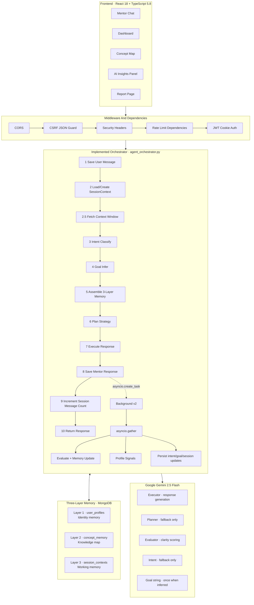
```mermaid
flowchart TD
    subgraph Frontend["Frontend · React 18 + TypeScript 5.8"]
        UI["Mentor Chat"]
        DASH["Dashboard"]
        CMAP["Concept Map"]
        SESS["AI Insights Panel"]
        REP["Report Page"]
    end
    subgraph MW["Middleware And Dependencies"]
        direction LR
        CORS["CORS"] --> CSRF["CSRF JSON Guard"] --> SEC["Security Headers"] --> RATE["Rate Limit Dependencies"] --> AUTH["JWT Cookie Auth"]
    end
    subgraph ORCH["Implemented Orchestrator · agent_orchestrator.py"]
        direction TB
        S1["1 Save User Message"] --> S2["2 Load/Create SessionContext"]
        S2 --> S25["2.5 Fetch Context Window"]
        S25 --> S3["3 Intent Classify"]
        S3 --> S4["4 Goal Infer"]
        S4 --> S5["5 Assemble 3-Layer Memory"]
        S5 --> S6["6 Plan Strategy"]
        S6 --> S7["7 Execute Response"]
        S7 --> S8["8 Save Mentor Response"]
        S8 --> S9["9 Increment Session Message Count"]
        S9 --> S10["10 Return Response"]
        S8 -.->|"asyncio.create_task"| BG["Background v2"]
        BG --> GATH["asyncio.gather"]
        GATH --> EVAL["Evaluate + Memory Update"]
        GATH --> PSIG["Profile Signals"]
        GATH --> FINAL["Persist intent/goal/session updates"]
    end
    subgraph MEM["Three-Layer Memory · MongoDB"]
        L1["Layer 1 · user_profiles\nIdentity memory"]
        L2["Layer 2 · concept_memory\nKnowledge map"]
        L3["Layer 3 · session_contexts\nWorking memory"]
    end
    subgraph AI["Google Gemini 2.5 Flash"]
        G1["Executor · response generation"]
        G2["Planner · fallback only"]
        G3["Evaluator · clarity scoring"]
        G4["Intent · fallback only"]
        G5["Goal string · once when inferred"]
    end
    Frontend --> MW --> ORCH
    ORCH <--> MEM
    ORCH --> AI
```

```text
Browser request
  -> CORS: checks configured origins, credentials, methods, headers
  -> CSRFProtectionMiddleware: rejects non-JSON POST/PUT/PATCH/DELETE
  -> SecurityHeadersMiddleware: adds CSP, X-Frame-Options, nosniff, cache headers
  -> Pydantic validation: rejects malformed bodies with 422
  -> rate_limit dependency where attached: login 5/min, chat 30/min, guest 10/min
  -> get_current_user dependency where attached: verifies access_token HttpOnly cookie
  -> route ownership checks: rejects inaccessible chats/roadmaps/user data
```

## How Synapse Knows Who You Are

The memory system is not a database of trivia about the user. It is a continuously evolving cognitive model built from behavior. Every message can reveal a learning intent, vocabulary level, domain interest, goal, misconception, recovery from confusion, or need to slow down. After onboarding, the system does not repeatedly ask "what is your learning style?" as a form. It infers from message content, technical vocabulary, domains mentioned, clarity scores, mastery histories, session momentum, and recurring struggle patterns.

The design prevents short-term conversational noise from overwriting long-term learner identity. A low clarity score in a recursion session does not mean the user is globally weak. A casual mention of an interview can update career signals without touching concept mastery. A concept only enters the knowledge map when the evaluator extracts a supported technical concept and the session is not passive.


```mermaid
flowchart LR
    subgraph L1["Layer 1 — Identity Memory · user_profiles"]
        direction TB
        A1["experience_level"]
        A2["preferred_learning_style"]
        A3["mentoring_tone"]
        A4["career_interests"]
        A5["global_strengths / global_weaknesses"]
        A6["inferred_vocabulary_level"]
        A7["implicit_career_signals"]
    end
    subgraph L2["Layer 2 — Concept Memory · concept_memory"]
        direction TB
        B1["mastery_level (0.0-1.0)"]
        B2["exposure_count"]
        B3["mastery_history (capped at 10)"]
        B4["misconceptions (deduplicated, capped at 20)"]
        B5["last_clarity_score"]
        B6["domain"]
    end
    subgraph L3["Layer 3 — Session Memory · session_contexts"]
        direction TB
        C1["session_goal"]
        C2["session_intent"]
        C3["goal_inferred / goal_confirmed"]
        C4["session_momentum"]
        C5["session_clarity"]
        C6["active_concepts"]
        C7["message_count"]
    end
    USR["User Message"] --> L3
    L3 -->|"learning evaluation"| L2
    L2 -->|"patterns can trigger"| L1
    L1 -.->|"tone and examples"| RESP["Agent Response"]
    L2 -.->|"depth and prerequisites"| RESP
    L3 -.->|"momentum and goal"| RESP
```

| Layer | Collection | Updated By | Updated When | Frequency |
|---|---|---|---|---|
| L1 Identity | `user_profiles` | `ProfileService`, `MemoryAgent.update_profile_signals` | Onboarding, profile signal extraction, strengths/weaknesses updates | Rare |
| L2 Concepts | `concept_memory` | `ConceptMemoryService` | After active learning evaluations with extracted supported concepts | Per evaluated learning message |
| L3 Session | `session_contexts` | `SessionContextService` | Session creation, goal updates, clarity updates, active concepts, atomic `$inc` message count | Every processed message |
| Meta | `learning_analyses` | `LearningCycleService` | Trigger rules exist, but the service is not wired into the orchestrator in current code | Not currently scheduled |

**How the System Learns Who You Are From Scratch**

1. User signs up. `auth.py` creates a `users` document with `email`, `password_hash`, `name`, `role: "user"`, `created_at`, `last_login`, `failed_attempts: 0`, and `lock_until: None`. It also creates legacy `user_memory` with `Onboarding()` defaults.
2. Onboarding submits `why_here`, `guidance_type`, `experience_level`, and `mentoring_style`. `onboarding.py` writes legacy memory and calls `ProfileService.update_from_onboarding()`, which writes `experience_level`, maps `mentoring_style` to `mentoring_tone`, and maps `guidance_type` to `career_interests`.
3. First chat message. `AgentOrchestrator._prepare_message_pipeline()` creates a chat if needed, writes the user message synchronously, and lazily creates `SessionContext` with `session_intent: "unknown"`, `session_clarity: 50.0`, `session_momentum: "cold_start"`, `message_count: 0`, no goal, no domain, and empty active concepts.
4. Early messages. `IntentClassifierService.classify()` returns `unknown` when `message_count < 3`. The third user message is the first classification point in the current orchestrator path.
5. Goal inference. `GoalInferenceService.should_infer()` fires only when no goal is confirmed or inferred, no goal is set, intent is not casual, and `session_context.message_count == 2` with intent in `learning`, `problem_solving`, or `unknown`.
6. First learning evaluation. After the response is saved, `_run_background_tasks_v2()` calls `asyncio.gather()` for evaluator work and profile signals. Passive mode stops concept and clarity writes for casual or early unknown sessions.
7. After several sessions, `career_interests`, `implicit_career_signals`, and `inferred_vocabulary_level` may accumulate in `user_profiles`; concept records accumulate `exposure_count`, `last_clarity_score`, misconceptions, and up to 10 mastery snapshots.
8. Later usage. ZPD recommendations become useful once concept mastery exists. `LearningPatternService` can classify velocity only when at least three concepts exist and individual concept histories have at least three entries.

Passive evaluation return:

```json
{
  "clarity_score": null,
  "understanding_delta": 0,
  "confusion_trend": "not_applicable",
  "engagement_level": "estimated from message length",
  "struggle_detected": null,
  "concepts_discussed": [],
  "evaluation_mode": "passive",
  "skip_memory_update": true
}
```

## How Concept Mastery Is Calculated

Concept mastery is not whatever the LLM says the user knows. Gemini supplies clarity scores and concept extraction; Python normalizes concepts, caps histories, increments exposure, calculates recency, and computes `mastery_level`. The implemented formula uses the latest concept clarity score, not the historical mean. Exposure is capped at 10. Recency is a linear post-7-day decay that floors at `0.0`.

```text
mastery_score = (0.6 * clarity_factor) + (0.3 * exposure_factor) + (0.1 * recency_factor)

clarity_factor = max(0.0, min(1.0, clarity_score / 100.0))
exposure_factor = min(exposure_count, 10) / 10.0
days_since = (datetime.utcnow() - last_seen).total_seconds() / 86400
if days_since <= 7: recency_factor = 1.0
else: recency_factor = max(0.0, 1.0 - 0.1 * ((days_since - 7) / 7))
```

```text
Concept: "Recursion"
- Latest concept clarity = 72/100 -> clarity_factor = 0.72
- exposure_count = 4 -> exposure_factor = 0.40
- last_seen = 5 days ago -> recency_factor = 1.0

mastery = (0.6 * 0.72) + (0.3 * 0.40) + (0.1 * 1.0)
        = 0.432 + 0.120 + 0.100
        = 0.652
```

| Mastery Range | Label | Zone | What This Means |
|---|---|---|---|
| 0.00-0.30 | New | ZPD candidate if prerequisites are met | Just introduced or not retained |
| 0.30-0.60 | Learning | ZPD candidate if prerequisites are met | Active understanding in progress |
| 0.60-0.85 | Proficient | ZPD edge in UI terms | Can apply with guidance |
| 0.85-1.00 | Mastered | UI mastered label | Reliable independent understanding |

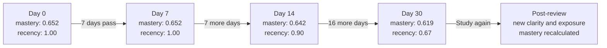
```mermaid
flowchart LR
    T0["Day 0\nmastery: 0.652\nrecency: 1.00"] -->|"7 days pass"| T7["Day 7\nmastery: 0.652\nrecency: 1.00"]
    T7 -->|"7 more days"| T14["Day 14\nmastery: 0.642\nrecency: 0.90"]
    T14 -->|"16 more days"| T30["Day 30\nmastery: 0.619\nrecency: 0.67"]
    T30 -->|"Study again"| BOOST["Post-review\nnew clarity and exposure\nmastery recalculated"]
```

## The Invariant That Cannot Be Bypassed

The evaluator fail-safe exists because LLMs are trained to be helpful, fluent, and encouraging. That is valuable for the executor, but dangerous for scoring. A learner can say "I don't understand" and still receive an optimistic model-generated clarity score if the rest of the exchange looks engaged. Synapse treats explicit confusion as an invariant violation, not as an interpretation problem. After Gemini returns JSON, Python scans the raw user message. If a marker is present, clarity cannot rise above the previous session clarity, positive deltas are zeroed, an improving trend is changed to stable, and a missing struggle flag is filled. In v2, concept-level clarity scores are capped to the overall clarity too.

Confusion markers copied from `evaluator_agent.py`:

```text
"don't get it"
"dont get it"
"don't understand"
"dont understand"
"im confused"
"i'm confused"
"doesn't make sense"
"doesnt make sense"
"still unclear"
"lost"
"what do you mean"
```

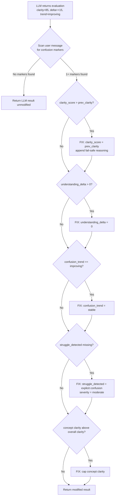
```mermaid
flowchart TD
    LLM["LLM returns evaluation\nclarity=85, delta=+15, trend=improving"]
    LLM --> SCAN{"Scan user message\nfor confusion markers"}
    SCAN -->|"No markers found"| PASS["Return LLM result unmodified"]
    SCAN -->|"1+ markers found"| C1{"clarity_score > prev_clarity?"}
    C1 -->|"Yes"| FIX1["FIX: clarity_score = prev_clarity\nappend fail-safe reasoning"]
    C1 -->|"No"| C2
    FIX1 --> C2{"understanding_delta > 0?"}
    C2 -->|"Yes"| FIX2["FIX: understanding_delta = 0"]
    C2 -->|"No"| C3
    FIX2 --> C3{"confusion_trend == improving?"}
    C3 -->|"Yes"| FIX3["FIX: confusion_trend = stable"]
    C3 -->|"No"| C4
    FIX3 --> C4{"struggle_detected missing?"}
    C4 -->|"Yes"| FIX4["FIX: struggle_detected = explicit confusion\nseverity = moderate"]
    C4 -->|"No"| C5
    FIX4 --> C5{"concept clarity above overall clarity?"}
    C5 -->|"Yes"| FIX5["FIX: cap concept clarity"]
    C5 -->|"No"| DONE["Return modified result"]
    FIX5 --> DONE
```

This logic is hardcoded in `backend/app/agents/evaluator_agent.py` at lines 225-270 for the v2 evaluator. It runs after the LLM call and overrides the JSON output. Prompt engineering cannot bypass it.

## Why Casual Conversations Never Corrupt Learning Data

If every message updated concept memory, "how are you?" and "explain recursion" would both become learning evidence. Synapse classifies intent before evaluation writes, and the evaluator enters passive mode for `casual` sessions and early `unknown` sessions. Passive mode still estimates engagement and allows profile signals, but it skips concept extraction, concept mastery, and clarity updates.

```text
LEARNING_KEYWORDS =
explain, understand, learn, how does, what is, why does, difference between,
concept, teach me, i dont understand, confused about, clarify, what are,
how do i, walk me through, study, prepare for, master, theory behind,
fundamentals

PROBLEM_SOLVING_KEYWORDS =
fix, bug, error, not working, help me with, write a, create a, build,
implement, generate, code for, script, how to make, debug, issue with,
failing, broken, solve

REVIEW_KEYWORDS =
remind me, recap, summary of, revisit, refresh, forgot, remember when,
we covered, last time, previously, again, review, go over again

CASUAL_KEYWORDS =
how are you, what do you think, tell me about yourself, whats up,
just chatting, bored, recommend, opinion, do you like, favorite,
fun fact, joke, what should i
```

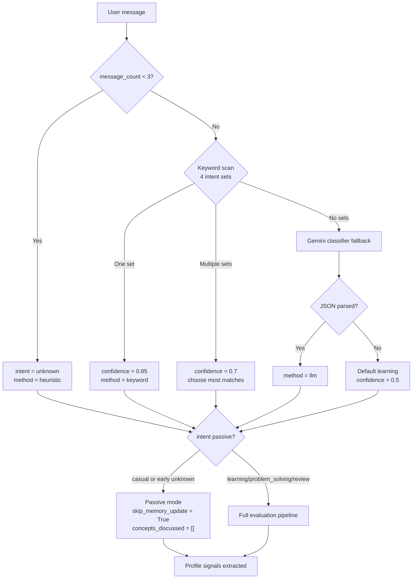
```mermaid
flowchart TD
    MSG["User message"] --> EARLY{"message_count < 3?"}
    EARLY -->|"Yes"| UNK["intent = unknown\nmethod = heuristic"]
    EARLY -->|"No"| KW{"Keyword scan\n4 intent sets"}
    KW -->|"One set"| KR["confidence = 0.85\nmethod = keyword"]
    KW -->|"Multiple sets"| MR["confidence = 0.7\nchoose most matches"]
    KW -->|"No sets"| LLM["Gemini classifier fallback"]
    LLM --> PARSE{"JSON parsed?"}
    PARSE -->|"Yes"| LR["method = llm"]
    PARSE -->|"No"| DEF["Default learning\nconfidence = 0.5"]
    UNK --> GATE
    KR --> GATE
    MR --> GATE
    LR --> GATE
    DEF --> GATE
    GATE{"intent passive?"} -->|"casual or early unknown"| PASS["Passive mode\nskip_memory_update = True\nconcepts_discussed = []"]
    GATE -->|"learning/problem_solving/review"| FULL["Full evaluation pipeline"]
    PASS --> PSIG["Profile signals extracted"]
    FULL --> PSIG
```

| Intent | Concept Memory | Session Clarity | Momentum | Profile Signals |
|---|---|---|---|---|
| `learning` | Yes | Yes | Yes | Yes |
| `problem_solving` | Yes | Yes | Yes | Yes |
| `review` | Yes | Yes | Yes | Yes |
| `casual` | No | No | No | Yes |
| `unknown` with `message_count <= 2` | No | No | No | Yes |

Even casual conversations are not wasted. `extract_profile_signals()` runs in background regardless of learning intent. If a user casually mentions a placement interview, the service can add `preparing for placement` or `preparing for technical interview` to `user_profiles.implicit_career_signals` through `$addToSet`.

## How the Planner Makes Decisions Without Asking the LLM

The planner receives learner state and returns response controls: strategy, tone, pacing, depth, focus concepts, assessment flags, goal inference, emotion, and memory-update hints. In `compute_deterministic_strategy()`, priority-ordered Python rules run first. If one matches, the planner returns immediately and the LLM is bypassed. Because the default last evaluation sets `scaffolding_recommendation: "full"`, the deterministic scaffolding branch normally returns before the LLM fallback.

| Priority | Condition | Strategy | LLM Called? | Theory In Comment |
|---|---|---|---|---|
| 1 | `message_count == 0` | `guide`, warm, slow | No | Joint attention before cognitive load |
| 2 | `confusion_type == "prerequisite_gap"` | `redirect`, supportive, slow | No | Vygotsky ZPD |
| 3 | `confusion_type == "misconception"` | `correct_misconception`, supportive, slow | No | Constructivist error correction |
| 4 | `confusion_type == "overwhelm"` | `simplify`, calm, very_slow | No | Cognitive Load Theory |
| 5 | `momentum == "stuck" and clarity < 30` | `encourage`, warm, slow | No | Flow Theory anxiety state |
| 6 | `momentum == "flowing" and clarity > 75` | `challenge`, fast | No | Flow channel optimization |
| 7a | `scaffolding == "full"` | `explain`, supportive, slow | No | Bruner scaffolding |
| 7b | `scaffolding == "partial"` | `guide`, medium | No | Bruner scaffolding |
| 7c | `scaffolding == "light"` | `challenge`, challenging, fast | No | Bruner scaffolding |
| Fallback | No deterministic rule returns | LLM selects JSON strategy | Yes | Prompt-defined strategy selection |

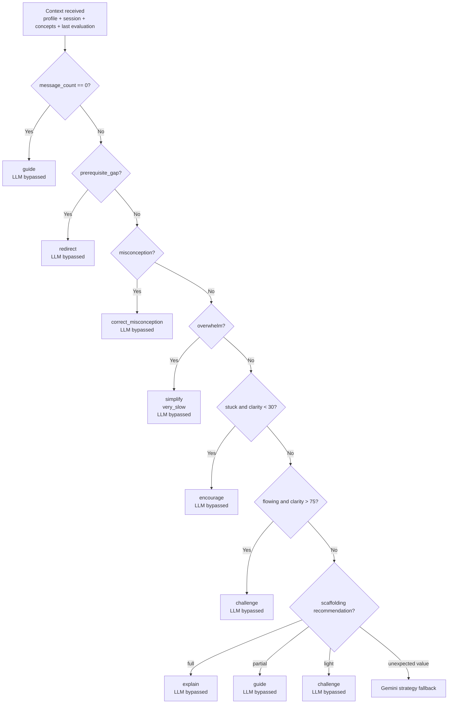
```mermaid
flowchart TD
    CTX["Context received\nprofile + session + concepts + last evaluation"]
    CTX --> R1{"message_count == 0?"}
    R1 -->|"Yes"| S1["guide\nLLM bypassed"]
    R1 -->|"No"| R2{"prerequisite_gap?"}
    R2 -->|"Yes"| S2["redirect\nLLM bypassed"]
    R2 -->|"No"| R3{"misconception?"}
    R3 -->|"Yes"| S3["correct_misconception\nLLM bypassed"]
    R3 -->|"No"| R4{"overwhelm?"}
    R4 -->|"Yes"| S4["simplify\nvery_slow\nLLM bypassed"]
    R4 -->|"No"| R5{"stuck and clarity < 30?"}
    R5 -->|"Yes"| S5["encourage\nLLM bypassed"]
    R5 -->|"No"| R6{"flowing and clarity > 75?"}
    R6 -->|"Yes"| S6["challenge\nLLM bypassed"]
    R6 -->|"No"| R7{"scaffolding recommendation?"}
    R7 -->|"full"| S7A["explain\nLLM bypassed"]
    R7 -->|"partial"| S7B["guide\nLLM bypassed"]
    R7 -->|"light"| S7C["challenge\nLLM bypassed"]
    R7 -->|"unexpected value"| LLM["Gemini strategy fallback"]
```

Planner LLM fallback receives learner profile, session state, concept mastery summary, last evaluation, learning patterns, recent conversation, deterministic context summary, and the current message. The required JSON contains `strategy`, `tone`, `pacing`, `response_depth`, `focus_concepts`, `should_assess`, `session_goal_inference`, `focus_areas`, `should_ask_question`, `detected_emotion`, `roadmap_relevant`, `verbosity`, `max_lines`, `chat_intent`, and `memory_update`.

Executor prompt contract. `ExecutorAgent._build_response_prompt()` injects profile, session, concept mastery, misconceptions, recent conversation, planner strategy, and user message. Its fixed opening is: "You are an expert mentor — a knowledgeable, patient human teacher who happens to be available 24/7. You are NOT a chatbot, NOT a search engine, and NOT an AI assistant."

## What Synapse Recommends Next and Why

Synapse implements Vygotsky's Zone of Proximal Development as a prerequisite graph. A concept is recommended when it is not already excluded by current mastery and every direct prerequisite meets the prerequisite threshold. The code defines 31 concepts across three domains: `python`, `dsa`, and `system_design`. The prerequisite-met threshold is `0.5`. `is_in_zpd()` treats a concept with current mastery `>= 0.7` as already mastered for recommendation purposes.

```text
variables -> data-types -> operators -> conditionals -> loops -> functions -> recursion -> dynamic-programming
variables -> data-types -> loops -> lists -> arrays -> sorting -> graphs
functions -> dictionaries -> api-basics -> load-balancing
```

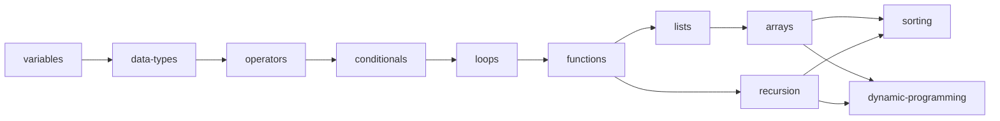
```mermaid
flowchart LR
    VAR["variables"] --> DT["data-types"]
    DT --> OPS["operators"]
    OPS --> COND["conditionals"]
    COND --> LOOPS["loops"]
    LOOPS --> FUNC["functions"]
    FUNC --> REC["recursion"]
    FUNC --> LST["lists"]
    LST --> ARR["arrays"]
    ARR --> SORT["sorting"]
    REC --> SORT
    ARR --> DP["dynamic-programming"]
    REC --> DP
```

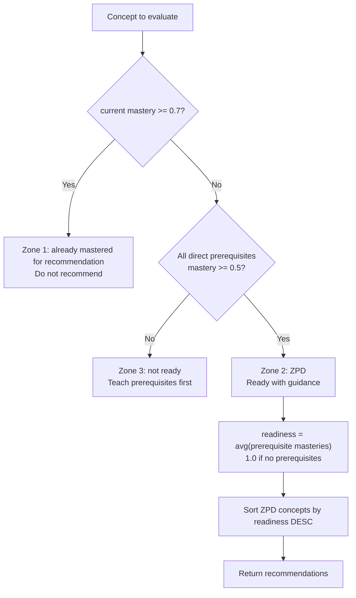
```mermaid
flowchart TD
    C["Concept to evaluate"] --> Z1{"current mastery >= 0.7?"}
    Z1 -->|"Yes"| ZONE1["Zone 1: already mastered for recommendation\nDo not recommend"]
    Z1 -->|"No"| Z2{"All direct prerequisites\nmastery >= 0.5?"}
    Z2 -->|"No"| ZONE3["Zone 3: not ready\nTeach prerequisites first"]
    Z2 -->|"Yes"| ZONE2["Zone 2: ZPD\nReady with guidance"]
    ZONE2 --> RS["readiness = avg(prerequisite masteries)\n1.0 if no prerequisites"]
    RS --> SORT["Sort ZPD concepts by readiness DESC"]
    SORT --> TOP["Return recommendations"]
```

The UI's concept-map label uses a stricter display threshold: `mastered` begins at `0.85`.

## Session Momentum — Csikszentmihalyi's Flow in Code

Flow theory places optimal learning between anxiety and boredom. Synapse tracks a simplified session momentum state from message count and clarity trajectory, not from LLM inference. `SessionContextService._derive_momentum()` uses three implemented rules: if `message_count < 3`, return `warming_up`; if new clarity is greater than old clarity, return `flowing`; if new clarity is lower than old clarity, return `stuck`; otherwise return `warming_up`.

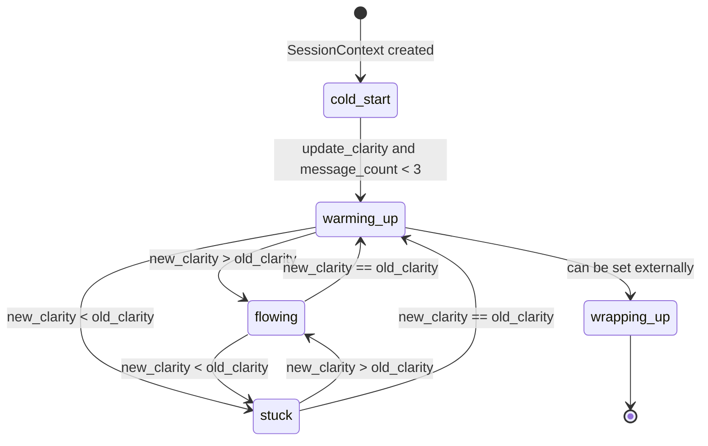
```mermaid
stateDiagram-v2
    [*] --> cold_start : SessionContext created
    cold_start --> warming_up : update_clarity and message_count < 3
    warming_up --> flowing : new_clarity > old_clarity
    warming_up --> stuck : new_clarity < old_clarity
    flowing --> stuck : new_clarity < old_clarity
    stuck --> flowing : new_clarity > old_clarity
    stuck --> warming_up : new_clarity == old_clarity
    flowing --> warming_up : new_clarity == old_clarity
    warming_up --> wrapping_up : can be set externally
    wrapping_up --> [*]
```

| State | Emoji | Meaning | PlannerAgent Effect |
|---|---|---|---|
| `cold_start` | ❄️ | Session just created | No direct rule unless context still reports message_count `0` |
| `warming_up` | 🌡️ | Too early or neutral clarity trajectory | Allows scaffolding/default strategy |
| `flowing` | ✨ | Clarity improved | Enables challenge when clarity `> 75` |
| `stuck` | ⚠️ | Clarity dropped | Enables encourage when clarity `< 30` |
| `wrapping_up` | 🎯 | Defined in model/UI, not derived in `_derive_momentum()` | Available for future wind-down behavior |

## User Journey Diagrams

### 12.1 — New User to First Personalized Response

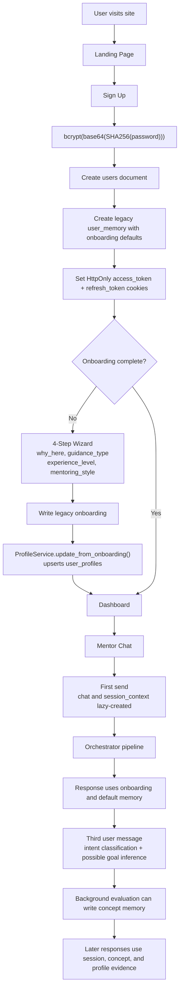
```mermaid
flowchart TD
    V["User visits site"] --> LAND["Landing Page"]
    LAND --> SIGN["Sign Up"]
    SIGN --> HASH["bcrypt(base64(SHA256(password)))"]
    HASH --> USER["Create users document"]
    USER --> LEG["Create legacy user_memory with onboarding defaults"]
    LEG --> COOK["Set HttpOnly access_token + refresh_token cookies"]
    COOK --> OB{"Onboarding complete?"}
    OB -->|"No"| WIZ["4-Step Wizard\nwhy_here, guidance_type\nexperience_level, mentoring_style"]
    WIZ --> WRITE1["Write legacy onboarding"]
    WRITE1 --> WRITE2["ProfileService.update_from_onboarding()\nupserts user_profiles"]
    WRITE2 --> DASH["Dashboard"]
    OB -->|"Yes"| DASH
    DASH --> MENTOR["Mentor Chat"]
    MENTOR --> MSG1["First send\nchat and session_context lazy-created"]
    MSG1 --> PIPE["Orchestrator pipeline"]
    PIPE --> RESP["Response uses onboarding and default memory"]
    RESP --> MSG3["Third user message\nintent classification + possible goal inference"]
    MSG3 --> EVAL["Background evaluation can write concept memory"]
    EVAL --> PERS["Later responses use session, concept, and profile evidence"]
```

### 12.2 — Authentication Token Lifecycle

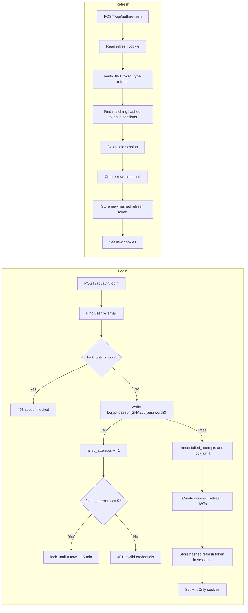
```mermaid
flowchart LR
    subgraph Login
        L1["POST /api/auth/login"] --> L2["Find user by email"]
        L2 --> L3{"lock_until > now?"}
        L3 -->|"Yes"| L4["403 account locked"]
        L3 -->|"No"| L5["Verify bcrypt(base64(SHA256(password)))"]
        L5 -->|"Fail"| L6["failed_attempts += 1"]
        L6 --> L7{"failed_attempts >= 5?"}
        L7 -->|"Yes"| L8["lock_until = now + 15 min"]
        L7 -->|"No"| L9["401 invalid credentials"]
        L5 -->|"Pass"| L10["Reset failed_attempts and lock_until"]
        L10 --> L11["Create access + refresh JWTs"]
        L11 --> L12["Store hashed refresh token in sessions"]
        L12 --> L13["Set HttpOnly cookies"]
    end
    subgraph Refresh
        R1["POST /api/auth/refresh"] --> R2["Read refresh cookie"]
        R2 --> R3["Verify JWT token_type refresh"]
        R3 --> R4["Find matching hashed token in sessions"]
        R4 --> R5["Delete old session"]
        R5 --> R6["Create new token pair"]
        R6 --> R7["Store new hashed refresh token"]
        R7 --> R8["Set new cookies"]
    end
```

### 12.3 — How a Single Message Becomes a Personalized Response

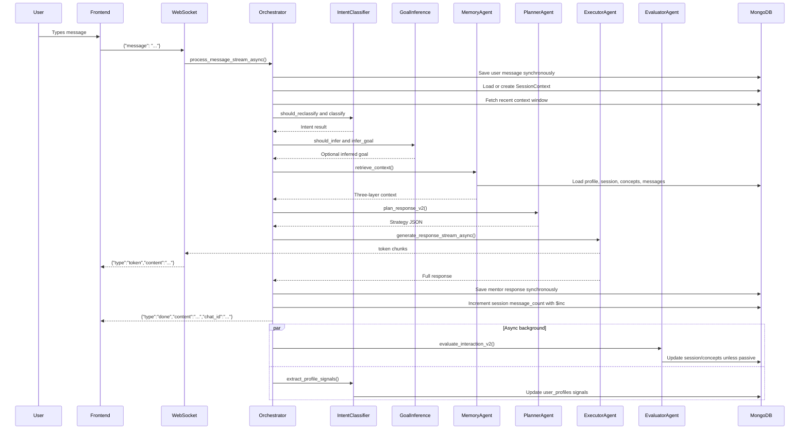
```mermaid
sequenceDiagram
    participant U as User
    participant FE as Frontend
    participant WS as WebSocket
    participant ORCH as Orchestrator
    participant IC as IntentClassifier
    participant GI as GoalInference
    participant MA as MemoryAgent
    participant PA as PlannerAgent
    participant EA as ExecutorAgent
    participant EV as EvaluatorAgent
    participant DB as MongoDB

    U->>FE: Types message
    FE->>WS: {"message": "..."}
    WS->>ORCH: process_message_stream_async()
    ORCH->>DB: Save user message synchronously
    ORCH->>DB: Load or create SessionContext
    ORCH->>DB: Fetch recent context window
    ORCH->>IC: should_reclassify and classify
    IC-->>ORCH: Intent result
    ORCH->>GI: should_infer and infer_goal
    GI-->>ORCH: Optional inferred goal
    ORCH->>MA: retrieve_context()
    MA->>DB: Load profile, session, concepts, messages
    MA-->>ORCH: Three-layer context
    ORCH->>PA: plan_response_v2()
    PA-->>ORCH: Strategy JSON
    ORCH->>EA: generate_response_stream_async()
    EA-->>WS: token chunks
    WS-->>FE: {"type":"token","content":"..."}
    EA-->>ORCH: Full response
    ORCH->>DB: Save mentor response synchronously
    ORCH->>DB: Increment session message_count with $inc
    ORCH-->>FE: {"type":"done","content":"...","chat_id":"..."}
    par Async background
        ORCH->>EV: evaluate_interaction_v2()
        EV->>DB: Update session/concepts unless passive
    and
        ORCH->>IC: extract_profile_signals()
        IC->>DB: Update user_profiles signals
    end
```

## Database Architecture

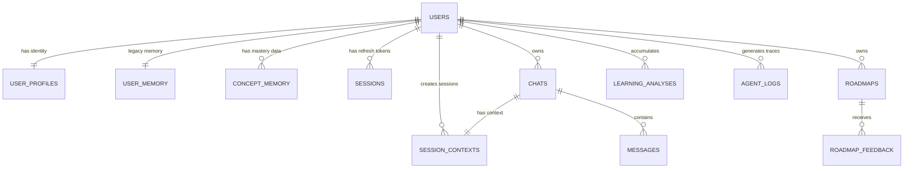
```mermaid
erDiagram
    USERS ||--|| USER_PROFILES : "has identity"
    USERS ||--|| USER_MEMORY : "legacy memory"
    USERS ||--o{ CONCEPT_MEMORY : "has mastery data"
    USERS ||--o{ SESSION_CONTEXTS : "creates sessions"
    USERS ||--o{ SESSIONS : "has refresh tokens"
    USERS ||--o{ CHATS : "owns"
    USERS ||--o{ ROADMAPS : "owns"
    USERS ||--o{ LEARNING_ANALYSES : "accumulates"
    CHATS ||--|| SESSION_CONTEXTS : "has context"
    CHATS ||--o{ MESSAGES : "contains"
    ROADMAPS ||--o{ ROADMAP_FEEDBACK : "receives"
    USERS ||--o{ AGENT_LOGS : "generates traces"
```

| Collection | Indexed Fields | TTL | Responsible Code |
|---|---|---|---|
| `users` | `email` unique, `role` | None | `auth.py`, `models/user.py` |
| `sessions` | `user_id`, `expires_at` | `expires_at` with `expireAfterSeconds=0` | `auth.py`, `models/session.py` |
| `chats` | `(user_id, updated_at desc)` | None | `chat_service.py`, `models/chat.py` |
| `messages` | `(chat_id, timestamp desc)`, `user_id` | None | `chat_service.py`, `models/chat.py` |
| `roadmaps` | `user_id` | None | `roadmap.py`, `models/roadmap.py` |
| `roadmap_feedback` | `(user_id, roadmap_id)` | None | `roadmap.py`, `models/roadmap.py` |
| `agent_logs` | `(user_id, timestamp desc)` | None | legacy logs |
| `user_memory` | `user_id` unique | None | legacy memory services |
| `interactions` | `(user_id, timestamp desc)` | None | legacy memory |
| `user_profiles` | `user_id` unique, `updated_at` | None | `ProfileService`, `MemoryAgent` |
| `concept_memory` | `user_id` unique, `(user_id, updated_at desc)` | None | `ConceptMemoryService` |
| `session_contexts` | `(session_id, user_id)` unique, `user_id`, `updated_at` | `SESSION_CONTEXT_TTL_DAYS * 86400`, default 30 days | `SessionContextService` |
| `system_traces` | `(user_id, session_id)`, `timestamp` | 30 days | `TraceService` |
| `learning_analyses` | `(user_id, created_at desc)` | None | `LearningCycleService` |

`UserProfileV2` exact fields: `_id`, `user_id`, `age_group=None`, `education_level=None`, `experience_level="beginner"`, `preferred_learning_style="mixed"`, `mentoring_tone="balanced"`, `career_interests=[]`, `global_strengths=[]`, `global_weaknesses=[]`, `inferred_vocabulary_level=None`, `implicit_career_signals=[]`, `created_at`, `updated_at`.

`ConceptRecord` exact fields: `concept_id`, `concept_name`, `domain`, `mastery_level=0.0`, `exposure_count=0`, `last_clarity_score=None`, `misconceptions=[]`, `first_seen`, `last_seen`, `mastery_history=[]`. `mastery_level` is validated between `0.0` and `1.0`. `mastery_history` is capped at `$slice: -10`; misconceptions are deduplicated and capped at 20.

`SessionContext` exact fields: `_id`, `session_id`, `user_id`, `session_goal=None`, `session_intent="unknown"`, `goal_inferred=False`, `goal_confirmed=False`, `intent_classified_at_message=None`, `session_domain=None`, `active_concepts=[]`, `session_clarity=50.0`, `session_confusion_points=[]`, `message_count=0`, `session_momentum="cold_start"`, `created_at`, `updated_at`.

## API Reference

| Method | Endpoint | Auth | Rate Limit | Description |
|---|---|---|---|---|
| GET | `/` | No | None | Root API status message |
| GET | `/health` | No | None | API and MongoDB health |
| POST | `/api/auth/signup` | No | None | Create user, legacy memory, refresh session, cookies |
| POST | `/api/auth/login` | No | 5/min/IP | Verify password, lock after 5 failures for 15 minutes, issue cookies |
| POST | `/api/auth/refresh` | Refresh cookie | None | Rotate refresh and access tokens |
| POST | `/api/auth/logout` | Refresh cookie optional | None | Delete matching refresh session and clear cookies |
| POST | `/api/auth/change-password` | Access cookie | None | Verify old password, update hash, revoke sessions |
| POST | `/api/chat` | Access cookie | 30/min/IP | Process message through orchestrator |
| POST | `/api/chat/guest` | No | 10/min/IP | Guest chat path |
| POST | `/api/tts` | No route dependency | None | Convert text to audio |
| GET | `/api/user/me` | Access cookie | None | Current user and onboarding status |
| GET | `/api/user/memory` | Access cookie | None | Legacy memory document |
| GET | `/api/user/dashboard` | Access cookie | None | Legacy dashboard insights |
| GET | `/api/user/report` | Access cookie | None | Deterministic learning report |
| PUT | `/api/user/profile` | Access cookie | None | Update legacy interests/goals |
| GET | `/api/user/concept-map` | Access cookie | None | Concept nodes and inferred edges |
| GET | `/api/user/recommendations` | Access cookie | None | Weak-concept recommendations, velocity, recent sessions |
| GET | `/api/chats` | Access cookie | None | Paginated chat sessions |
| POST | `/api/chats` | Access cookie | None | Create chat session |
| GET | `/api/chats/{chat_id}/messages` | Access cookie | None | Paginated messages |
| PATCH | `/api/chats/{chat_id}` | Access cookie | None | Update chat title |
| DELETE | `/api/chats/{chat_id}` | Access cookie | None | Delete owned chat and messages |
| GET | `/api/chats/{chat_id}/context` | Access cookie | None | Registered in both `main.py` and `chat_history.py` |
| PATCH | `/api/chats/{chat_id}/context/goal` | Access cookie | None | Update goal and confirmation flags |
| GET | `/api/onboarding/status` | Access cookie | None | Check onboarding status |
| POST | `/api/onboarding/complete` | Access cookie | None | Complete onboarding and dual-write profile |
| GET | `/api/onboarding/questions` | No dependency | None | Return onboarding form structure |
| GET | `/api/roadmap/current` | Access cookie | None | Current active roadmap |
| GET | `/api/roadmap/history` | Access cookie | None | Archived roadmaps |
| POST | `/api/roadmap/generate` | Access cookie | None | Generate and store new roadmap |
| POST | `/api/roadmap/feedback` | Access cookie | None | Submit feedback; handler expects `roadmap_id` but route path omits it |
| POST | `/api/roadmap/regenerate` | Access cookie | None | Regenerate roadmap; handler expects `roadmap_id` but route path omits it |
| PUT | `/api/roadmap/step/{roadmap_id}/{step_id}/complete` | Access cookie | None | Mark roadmap step complete |
| GET | `/api/analytics/learning` | Access cookie | None | Legacy analytics data |
| GET | `/api/analytics/concept-map` | Access cookie | None | v2 dashboard concept map path |
| GET | `/api/analytics/recommendations` | Access cookie | None | v2 recommendations path |
| GET | `/api/traces/` | Access cookie | None | Recent cognitive traces |
| WS | `/ws/chat/{session_id}` | Access cookie | None | Streaming mentor chat |

WebSocket protocol:

```json
{"message": "Explain recursion"}
{"type": "typing", "content": ""}
{"type": "token", "content": "Recursion"}
{"type": "done", "content": "Full response text", "chat_id": "mongo_chat_id"}
{"type": "error", "content": "Invalid message format"}
```

Frontend exported functions: `sendMessage`, `sendMessageWithUserId`, `fetchChatContext`, `setSessionGoal`, `fetchChatSessions`, `fetchChatMessages`, `createChatSession`, `deleteChatSession`, `streamAudio`, `fetchUserState`, `fetchUserMemory`, `fetchDashboardData`, `updateUserProfile`, `fetchRoadmap`, `generateRoadmap`, `submitRoadmapFeedback`, `regenerateRoadmap`, `fetchAnalyticsData`, `fetchConceptMap`, `fetchRecommendations`, `fetchDashboardRecommendations`, `fetchLearningReport`, `fetchSessionTraces`.

## Tech Stack

**Backend:**

| Package | Version | Purpose in Synapse |
|---|---|---|
| `fastapi` | `0.128.0` | HTTP API, routing, dependency auth, validation errors |
| `uvicorn[standard]` | `0.40.0` | ASGI server |
| `pydantic[email]` | `2.12.5` | Request models and memory schemas |
| `python-multipart` | `0.0.22` | Multipart support dependency |
| `motor` | `3.7.1` | Async MongoDB driver |
| `pymongo` | `4.16.0` | MongoDB driver foundation and ObjectId usage |
| `python-jose[cryptography]` | `3.5.0` | JWT encode/decode |
| `passlib[bcrypt]` | `1.7.4` | Installed auth dependency; code uses direct `bcrypt` helpers |
| `bcrypt` | `5.0.0` | Password and refresh-token hashing |
| `google-genai` | `1.2.0` | Gemini client for agents |
| `httpx` | `0.28.1` | HTTP client/test dependency |
| `requests` | `2.32.5` | HTTP utility dependency |
| `python-dotenv` | `1.2.1` | `.env` loading support |
| `pydantic-settings` | `2.13.1` | Environment-backed settings |
| `bleach` | `6.3.0` | Input sanitization |

**Frontend:**

| Package | Version | Purpose in Synapse |
|---|---|---|
| `react` | `^18.3.1` | UI runtime |
| `react-dom` | `^18.3.1` | DOM renderer |
| `typescript` | `^5.8.3` | Static typing |
| `vite` | `^7.3.1` | Frontend build/dev server |
| `@vitejs/plugin-react-swc` | `^3.11.0` | React/SWC Vite integration |
| `framer-motion` | `^12.29.2` | UI animation |
| `lucide-react` | `^0.462.0` | Icons |
| `react-router-dom` | `^6.30.1` | Client routing |
| `@tanstack/react-query` | `^5.83.0` | Async state/query library |
| `react-markdown` | `^10.1.0` | Markdown rendering |
| `remark-gfm` | `^4.0.1` | GitHub-flavored markdown |
| `remark-math` | `^6.0.0` | Math markdown support |
| `rehype-katex` | `^7.0.1` | KaTeX rendering |
| `katex` | `^0.16.45` | Math display |
| `recharts` | `^3.8.0` | Analytics charts |
| `zod` | `^3.25.76` | Frontend validation |
| `tailwindcss` | `^3.4.17` | Styling framework |
| `@radix-ui/*` | multiple `^1.x`/`^2.x` | Accessible UI primitives |
| `vitest` | `^3.2.4` | Frontend test runner |

## The Science Behind Synapse

- **Tulving (1985) — Episodic, semantic, and procedural memory taxonomy.** Synapse maps this research distinction into software boundaries: `session_contexts` are episodic working records of the current conversation, `concept_memory` is semantic knowledge about concepts and misconceptions, and `user_profiles` act like stable identity guidance for how the mentor should communicate.

- **Baddeley (2000) — Working memory model.** Baddeley's model separates active, limited-capacity working context from long-term memory. `SessionContext` implements that boundary in code: it holds the current goal, intent, momentum, active concepts, confusion points, clarity, and message count, while remaining separate from long-term concept mastery and identity memory.

- **Vygotsky (1978) — Zone of Proximal Development.** Synapse implements ZPD in `prerequisite_graph.py`. A concept is teachable only when all direct prerequisites are at least `0.5` mastery and the concept itself is below the recommendation exclusion threshold `0.7`.

- **Bruner (1976) — Scaffolding theory.** Synapse converts scaffolding into evaluator and planner behavior. The evaluator assigns `scaffolding_recommendation` from mastery: below `0.3` is `full`, below `0.6` is `partial`, otherwise `light`; the planner then turns that into explain, guide, or challenge strategies.

- **Corbett & Anderson (1994) — Bayesian Knowledge Tracing.** Synapse uses the idea of separating evidence signals for knowledge, while implementing a deterministic simplified formula rather than full BKT. Clarity acts as evidence of understanding, exposure as practice, and recency as retention.

- **Csikszentmihalyi (1990) — Flow Theory.** Synapse tracks session momentum as a flow proxy. Rising clarity moves a session toward `flowing`; falling clarity moves it to `stuck`. `flowing` with clarity above `75` enables challenge, while `stuck` with clarity below `30` triggers encouragement.

- **Ebbinghaus (1885) — Forgetting curve.** Synapse implements retention decay in `_recency_factor()`: full recency for seven days, then a `0.1` reduction per week after that, floored at `0.0`.

## Setup Instructions

Prerequisites:

| Tool | Version |
|---|---|
| Python | `3.11` |
| Node.js | compatible with Vite 7 |
| MongoDB | local MongoDB or Atlas connection |
| Git | current stable |

```bash
git clone https://github.com/akshanshmaurya/Synapse.git
cd Synapse
cd backend
python -m venv .venv
.venv\Scripts\activate
pip install -r requirements.txt
pip install -r requirements-dev.txt
cd ..
npm install
```

| Variable | Required | Default | Description |
|---|---|---|---|
| `MONGO_URI` | Yes | none | MongoDB connection URI |
| `MONGODB_DB` | Yes | none | Database name |
| `JWT_SECRET` | Yes | none | JWT signing secret |
| `JWT_ALGORITHM` | No | `HS256` | JWT signing algorithm |
| `ACCESS_TOKEN_EXPIRE_MINUTES` | No | `30` | Access-token lifetime |
| `REFRESH_TOKEN_EXPIRE_DAYS` | No | `7` | Refresh-token lifetime |
| `GEMINI_API_KEY` | Yes | none | Google Gemini API key |
| `GEMINI_MODEL` | No | `gemini-2.5-flash` | Gemini model used by agents |
| `MAX_EVALUATION_HISTORY` | No | `20` | Legacy capped evaluation history |
| `MAX_SESSION_DATES` | No | `100` | Legacy capped session dates |
| `MAX_RECENT_MESSAGES` | No | `10` | Recent message context limit |
| `MAX_STRUGGLES` | No | `20` | Legacy struggle cap |
| `SESSION_CONTEXT_TTL_DAYS` | No | `30` | TTL for `session_contexts.updated_at` |
| `ELEVENLABS_API_KEY` | No | empty string | Optional TTS key |
| `ENVIRONMENT` | No | `development` | Enables production-only settings |
| `CORS_ORIGINS` | No | `http://localhost:3000,http://localhost:5173` | Allowed frontend origins |
| `COOKIE_DOMAIN` | No | `localhost` | Cookie domain |

Run backend:

```bash
cd backend
.venv\Scripts\activate
uvicorn app.main:app --reload
```

Run frontend:

```bash
npm run dev
```

Run tests:

```bash
cd backend
.venv\Scripts\activate
pytest -q
```

CI runs:

```bash
ruff check app/ tests/
pytest -q --tb=short --cov=app --cov-report=term
```

Docker backend only:

```bash
cd backend
docker build -t synapse-backend .
docker run --env-file .env -p 8000:8000 synapse-backend
```

## Contributing And Project Status

Test coverage inventory from `backend/tests/`: 74 test functions.

```text
conftest.py
test_agents_pipeline.py
test_analytics.py
test_api_endpoints.py
test_auth.py
test_chat_history_routes.py
test_concept_memory_service.py
test_errors.py
test_evaluator_logic.py
test_evaluator_memory.py
test_intent_goal_services.py
test_jwt.py
test_memory_agent_v2.py
test_orchestrator_v2.py
test_password.py
test_profile_service.py
test_rate_limiter.py
test_session_context_service.py
test_websocket.py
```

| Feature | Status | Implemented In |
|---|---|---|
| Cookie JWT auth, refresh rotation, lockout | Complete | `backend/app/routes/auth.py`, `backend/app/auth/*` |
| Password pre-hash before bcrypt | Complete | `backend/app/auth/password.py` |
| WebSocket streaming chat | Complete | `backend/app/routes/ws_chat.py`, `src/hooks/use-mentor-socket.ts` |
| REST chat fallback | Complete | `backend/app/main.py`, `src/pages/MentorPage.tsx` |
| Three-layer memory schemas | Complete | `backend/app/models/memory_v2.py` |
| Context assembly | Complete | `backend/app/agents/memory_agent.py` |
| Intent guard and passive mode | Complete | `intent_classifier_service.py`, `evaluator_agent.py` |
| Confusion fail-safe | Complete | `backend/app/agents/evaluator_agent.py` |
| Deterministic planner rules | Complete | `backend/app/agents/planner_agent.py` |
| Concept mastery formula | Complete | `backend/app/services/concept_memory_service.py` |
| ZPD prerequisite graph | Complete | `backend/app/knowledge/prerequisite_graph.py` |
| Session momentum derivation | Complete | `backend/app/services/session_context_service.py` |
| Cognitive trace logging | Complete | `backend/app/services/trace_service.py` |
| Concept map and recommendations endpoints | Complete | `backend/app/main.py` |
| Learning report endpoint | Complete | `backend/app/services/report_service.py` |

| Area | What Exists | What Is Missing |
|---|---|---|
| `LearningCycleService` | Trigger rules, velocity/pattern aggregation, `learning_analyses` writes | Not wired into `AgentOrchestrator` |
| Dashboard v2 service | v2 method stubs and ZPD builders | Calls methods not present in current services, so route safety depends on exception fallback |
| Roadmap feedback/regeneration routes | Handler logic exists | Route paths omit `roadmap_id` even though handler requires it |
| Session wrapping-up state | Model and UI state exist | No service currently derives `wrapping_up` |
| LLM planner fallback | Prompt exists | Deterministic scaffolding default usually prevents fallback from running |

| Phase | Direction |
|---|---|
| Phase 8 | Wire `LearningCycleService` into orchestrator background tasks with throttle checks |
| Phase 9 | Replace dashboard v2 placeholders with service methods that exist and are tested |
| Phase 10 | Add explicit prerequisite-graph visualization from canonical graph edges |
| Phase 11 | Add user-confirmed session-goal editing with domain persistence from frontend payload |
| Phase 12 | Expand onboarding to collect optional age group, education level, and learning style |
