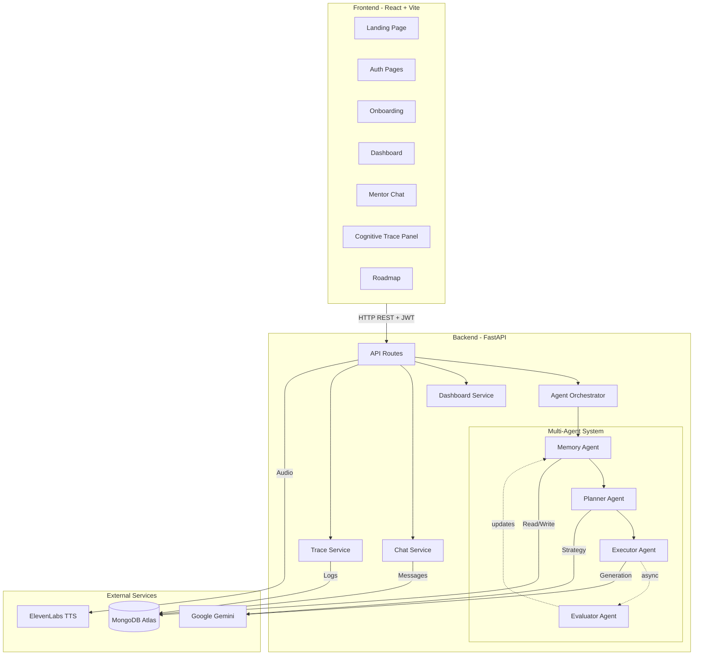
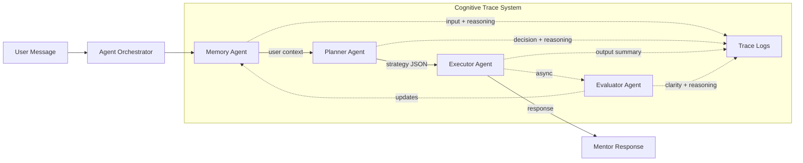
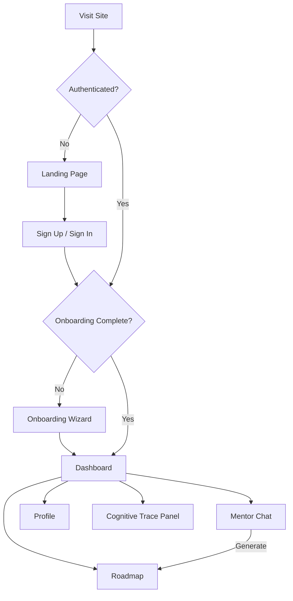
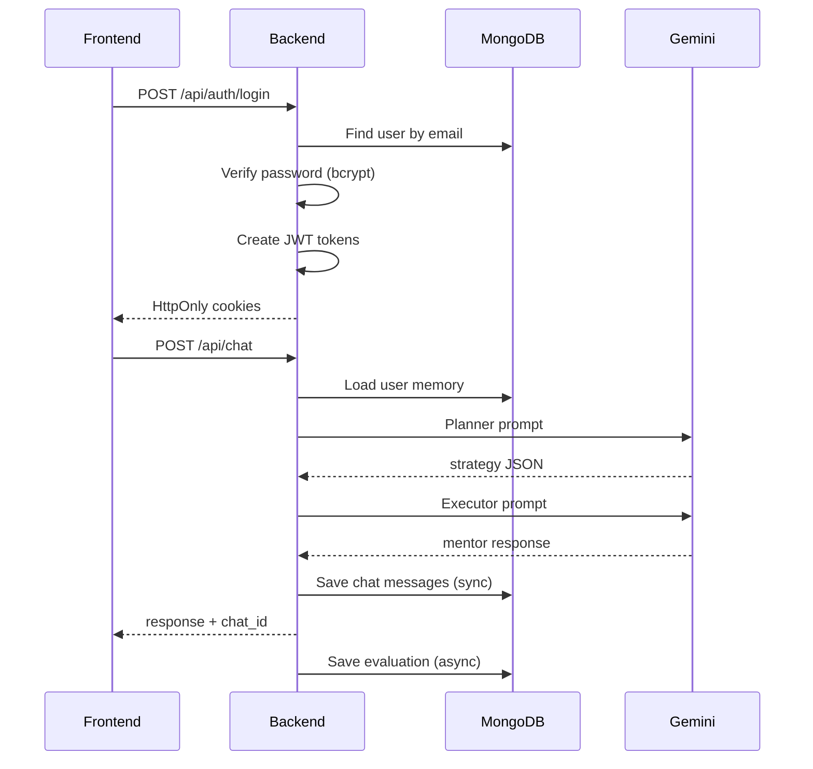
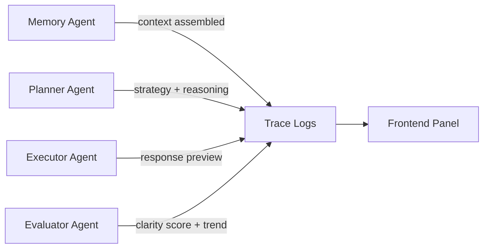
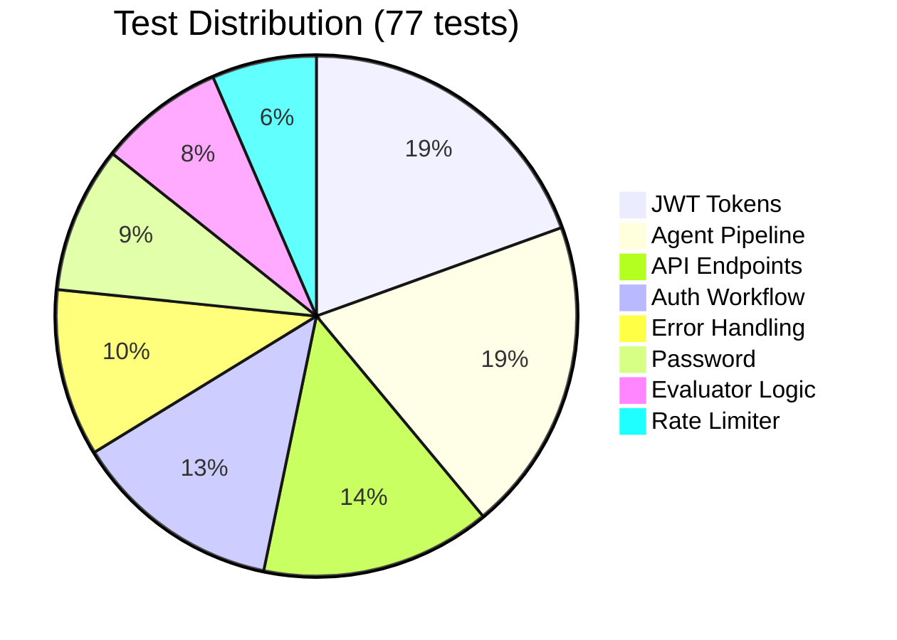

# 🧠 Synapse — Your AI Growth Mentor

> A calm, intelligent AI mentor that guides your personal and professional growth through thoughtful conversations and personalized learning roadmaps.


---

## 📋 Table of Contents

- [Overview](#overview)
- [🤖 Multi-Agent System](#multi-agent-system)
- [🏗 Architecture](#architecture)
- [✨ Features](#features)
- [🛠 Tech Stack](#tech-stack)
- [🚀 Getting Started](#getting-started)
- [📁 Project Structure](#project-structure)
- [🔐 Security](#security)
- [📡 API Reference](#api-reference)
- [🧪 Testing & CI](#testing--ci)
- [🎨 Brand Guidelines](#brand-guidelines)
- [📚 Documentation](#documentation)
- [🤝 Contributing](#contributing)
- [📄 License](#license)

---

## 🌟 Overview

Synapse is an **AI-powered growth mentorship platform** that goes beyond generic chatbots. It employs a **multi-agent architecture** where four specialized AI agents collaborate to deliver thoughtful, adaptive, and honest mentorship — remembering who you are, adapting to how fast you learn, and tracking *genuine understanding*, not just activity.

| Feature | Description |
|---------|-------------|
| **Adaptive Mentorship Chat** | Context-aware AI that adapts tone, pacing, and depth to your learning state |
| **Personalized Learning Roadmaps** | AI-generated pathways broken into achievable stages and steps |
| **Analytics Dashboard** | Momentum analysis with clarity scores, streaks, and next-focus recommendations |
| **Evaluator Tracking** | Real-time comprehension scoring that cannot be gamed by effort alone |
| **Cognitive Trace System** | Live visualization of AI reasoning (why the system responded the way it did) |
| **Voice Output** | Optional TTS via ElevenLabs for an audio mentorship experience |

### Why Synapse?

Most learning platforms equate **effort with understanding** — they count sessions, videos watched, and quizzes completed. Synapse differentiates them:

- A user who keeps chatting is **not necessarily learning** — the Evaluator Agent enforces this invariant
- A user who expresses explicit confusion (e.g. "I don't get it") **cannot increase their clarity score** — a hard-coded fail-safe prevents false positive progress
- Guidance strategy **adapts in real time** based on comprehension trends, not just message history

---

## 🤖 Multi-Agent System

Synapse uses four specialized agents coordinated by an Orchestrator. Each agent has a single responsibility and its own reasoning domain.

### Agent Roles

| Agent | Role | Key Responsibility |
|-------|------|--------------------|
| **Memory Agent** | The Librarian | Loads and persists user profile, struggles, evaluation history, and learning pace |
| **Planner Agent** | The Strategist | Analyzes user context + message to decide response strategy, tone, and pacing |
| **Executor Agent** | The Voice | Generates the actual mentor response or learning roadmap using the Planner's strategy |
| **Evaluator Agent** | The Judge | Scores the interaction for comprehension quality; enforces fail-safe confusion logic |

### Adaptive Mentorship Flow

Every user message triggers the full pipeline:

1. **Memory** retrieves the user's full context (profile, struggles, clarity history, recent chat)
2. **Planner** decides strategy — `encourage`, `teach`, `challenge`, `reflect`, `support`, or `celebrate` — based on clarity score and confusion trend
3. **Executor** generates a response constrained by verbosity, pacing, and line limits from the Planner
4. **Response is saved** synchronously before returning to the user
5. **Evaluator** runs asynchronously in the background — scores comprehension (0–100), detects struggles, updates memory

### Learning Evaluation Model

The Evaluator enforces **strict intellectual honesty**:

```
clarity_score    — 0 to 100, measures genuine understanding quality
understanding_delta — change from previous interaction (-10 to +10)
confusion_trend  — improving | stable | worsening
```

**Fail-Safe Rule:** If a user says "I don't get it", "I'm confused", or any explicit confusion marker, the system **blocks** any clarity increase, forces delta ≤ 0, and prevents the trend from showing "improving". This cannot be overridden by the LLM.

**What counts as positive understanding:**
- Correctly paraphrasing a concept in their own words
- Applying a concept to a new example
- Answering "why" or "how" correctly
- Correcting a previous misconception

**What does NOT count:**
- Continuing to chat
- Asking more questions
- Polite or engaged tone
- Number of sessions

---

## 🏗 Architecture

### High-Level System Architecture


```mermaid
flowchart TB
    subgraph FE["Frontend - React + Vite"]
        LP[Landing Page]
        AUTH[Auth Pages]
        OB[Onboarding]
        DASH[Dashboard]
        MENTOR[Mentor Chat]
        TRACE_UI[Cognitive Trace Panel]
        ROAD[Roadmap]
    end

    subgraph BE["Backend - FastAPI"]
        API[API Routes]
        ORCH[Agent Orchestrator]
        subgraph Agents["Multi-Agent System"]
            MEM[Memory Agent]
            PLAN[Planner Agent]
            EXEC[Executor Agent]
            EVAL[Evaluator Agent]
        end
        DASH_SVC[Dashboard Service]
        TRACE_SVC[Trace Service]
        CHAT_SVC[Chat Service]
    end

    subgraph EXT["External Services"]
        MONGO[(MongoDB Atlas)]
        GEMINI[Google Gemini]
        ELEVEN[ElevenLabs TTS]
    end

    FE -->|HTTP REST + JWT| API
    API --> ORCH
    ORCH --> MEM
    MEM --> PLAN
    PLAN --> EXEC
    EXEC -.->|async| EVAL
    EVAL -.->|updates| MEM
    API --> DASH_SVC
    API --> CHAT_SVC
    API --> TRACE_SVC

    MEM -->|Read/Write| MONGO
    CHAT_SVC -->|Messages| MONGO
    TRACE_SVC -->|Logs| MONGO
    PLAN -->|Strategy| GEMINI
    EXEC -->|Generation| GEMINI
    API -->|Audio| ELEVEN
```

### Multi-Agent Pipeline


```mermaid
flowchart LR
    MSG[User Message] --> ORCH[Agent Orchestrator]

    ORCH --> MEM[Memory Agent]
    MEM -->|user context| PLAN[Planner Agent]
    PLAN -->|strategy JSON| EXEC[Executor Agent]
    EXEC -->|response| RESP[Mentor Response]

    EXEC -.->|async| EVAL[Evaluator Agent]
    EVAL -.->|updates| MEM

    subgraph Trace["Cognitive Trace System"]
        MEM -.->|input + reasoning| LOG[Trace Logs]
        PLAN -.->|decision + reasoning| LOG
        EXEC -.->|output summary| LOG
        EVAL -.->|clarity + reasoning| LOG
    end
```

### Agent Pipeline — Step by Step

```
User sends message
        │
        ▼
[1] Orchestrator creates request_id, saves user message (sync)
        │
        ▼
[2] Memory Agent → loads profile, struggles, evaluation history, recent chat
        │       └─ TRACE: what context was assembled, last clarity score
        ▼
[3] Planner Agent → LLM call #1: decide strategy, tone, pacing, verbosity
        │       └─ TRACE: why this strategy (clarity band, confusion trend, detected emotion)
        ▼
[4] Executor Agent → LLM call #2: generate mentor response
        │       └─ TRACE: response preview, line count, style applied
        ▼
[5] Mentor response saved to MongoDB (sync) → returned to user
        │
        ▼ (async background — does not block response)
[6] Evaluator Agent → score clarity, detect struggle, update pace
        │       └─ TRACE: clarity movement, reasoning, stagnation flags
        ▼
[7] Memory Agent → persist evaluation, update effort metrics, learner traits
```

### User Flow


```mermaid
flowchart TD
    A[Visit Site] --> B{Authenticated?}
    B -->|No| C[Landing Page]
    C --> D[Sign Up / Sign In]
    D --> E{Onboarding Complete?}
    E -->|No| F[Onboarding Wizard]
    F --> G[Dashboard]
    B -->|Yes| E
    E -->|Yes| G
    G --> H[Mentor Chat]
    G --> I[Roadmap]
    G --> J[Profile]
    G --> K[Cognitive Trace Panel]
    H -->|Generate| I
```

### Data Flow — Login + Chat


```mermaid
sequenceDiagram
    participant FE as Frontend
    participant BE as Backend
    participant DB as MongoDB
    participant AI as Gemini

    FE->>BE: POST /api/auth/login
    BE->>DB: Find user by email
    BE->>BE: Verify password (bcrypt)
    BE->>BE: Create JWT tokens
    BE-->>FE: HttpOnly cookies
    FE->>BE: POST /api/chat
    BE->>DB: Load user memory
    BE->>AI: Planner prompt
    AI-->>BE: strategy JSON
    BE->>AI: Executor prompt
    AI-->>BE: mentor response
    BE->>DB: Save chat messages (sync)
    BE-->>FE: response + chat_id
    BE->>DB: Save evaluation (async)
```

---

## ✨ Features

### 💬 Mentorship Chat

| Feature | Description |
|---------|-------------|
| **Context-Aware** | Remembers your goals, struggles, and progress across sessions |
| **Adaptive Strategy** | 6 strategies: encourage, teach, challenge, reflect, support, celebrate |
| **Adaptive Pacing** | Slows down and simplifies if clarity is low; challenges you when you're ready |
| **Adaptive Tone** | warm, gentle, direct, curious, or affirming — set by Planner based on detected emotion |
| **Multi-Agent Collaboration** | 4 specialized agents work in concert on every message |
| **Voice Output** | Optional TTS via ElevenLabs |
| **Session History** | Chat sessions named by topic (via Planner's `chat_intent`) |

### 🗺 Roadmap Generation

| Feature | Description |
|---------|-------------|
| **AI-Generated** | Based on your goals, experience level, and mentoring style preference |
| **Structured** | 3–4 stages, each with 3–5 actionable steps |
| **Step Types** | learn, practice, build, reflect, milestone |
| **Interactive** | Mark steps complete, flag as stuck / unclear / needs help |
| **Adaptive Regeneration** | Evaluator analyzes feedback; Executor regenerates a gentler path if needed |
| **Visual Timeline** | Stage → Step hierarchy with color-coded UI hints |

### 📊 Analytics Dashboard

| Feature | Description |
|---------|-------------|
| **Momentum State** | starting → building → steady → accelerating, derived from sessions + clarity |
| **Next Focus** | Recommended next step from active roadmap or inferred from goals |
| **Recent Signals** | Observable learning patterns (struggles, progress) — not empty praise |
| **Daily Nurture** | Contextual reflective prompt shown only when active today |
| **Data-Driven** | All insights computed from raw signals — no false positive encouragement |

### 🧠 Evaluator Tracking

| Feature | Description |
|---------|-------------|
| **Clarity Score** | 0–100 per interaction, measuring understanding quality |
| **Confusion Safeguard** | Explicit confusion cannot inflate clarity — hard-coded fail-safe |
| **Trend Analysis** | Confusion trend: improving / stable / worsening |
| **Struggle Detection** | Real-time topic-level struggle flagging |
| **Pace Adaptation** | Learning pace (slow / moderate / fast) updates based on evaluation history |
| **Evaluation History** | Last 20 evaluations stored for trend analysis per user |
| **Learner Traits** | Perseverance and frustration tolerance derived from long-term patterns |

### 🔍 Cognitive Trace System ("Jury Mode")

Every AI decision is logged as a structured trace with four observability fields:

| Field | What it captures |
|-------|-----------------|
| `input_summary` | What the agent received |
| `decision` | What choice was made |
| `reasoning` | Why that choice was made |
| `output_summary` | What was produced |

Traces answer: *"Why did the system respond this way?"* and *"What influenced that decision?"*


```mermaid
flowchart LR
    MA[Memory Agent] -->|context assembled| LOG[Trace Logs]
    PA[Planner Agent] -->|strategy + reasoning| LOG
    EA[Executor Agent] -->|response preview| LOG
    VA[Evaluator Agent] -->|clarity score + trend| LOG
    LOG --> UI[Frontend Panel]
```

### 👤 User Profile

| Feature | Description |
|---------|-------------|
| **Growth Stage** | seedling → growing → flourishing |
| **Interests & Goals** | Add/remove, used to personalize every response |
| **Learning Pace** | slow / moderate / fast — auto-adjusted by Evaluator |
| **Evaluation History** | Visible through Dashboard signals |

### 🔐 Authentication & Security

| Feature | Description |
|---------|-------------|
| **JWT Tokens** | Access (30 min) + Refresh (7 days), stored in HttpOnly cookies |
| **Account Lockout** | 5 failed attempts → 15 min lockout |
| **Rate Limiting** | IP-based: 5 req/min (login), 30 req/min (chat) |
| **CSP Headers** | Strict Content-Security-Policy |
| **Password Security** | bcrypt(SHA256(password)) — avoids 72-byte bcrypt limit |
| **CORS** | Comma-separated origin allowlist via environment variable |
| **Cookie Domain** | Configurable via `COOKIE_DOMAIN` env var for production |

---

## 🛠 Tech Stack

### Frontend

| Category | Technology | Version | Purpose |
|----------|------------|---------|---------|
| **Framework** | React | 18.3.x | UI Framework |
| **Language** | TypeScript | 5.8.x | Type Safety |
| **Build Tool** | Vite | 7.3.x | Fast development & builds |
| **Styling** | TailwindCSS | 3.4.x | Utility-first CSS |
| **Components** | shadcn/ui | latest | Accessible component library |
| **Animations** | Framer Motion | 12.x | Smooth UI transitions |
| **Routing** | React Router | 6.x | Client-side routing |
| **State/Query** | TanStack Query | 5.x | Server state management |
| **Forms** | React Hook Form + Zod | 7.x / 3.x | Form validation |
| **Icons** | Lucide React | 0.46x | SVG icon library |
| **Markdown** | React Markdown | 10.x | Render markdown content |

### Backend

| Category | Technology | Version | Purpose |
|----------|------------|---------|---------|
| **Framework** | FastAPI | 0.128.x | Modern async Python web framework |
| **Server** | Uvicorn | 0.40.x | ASGI server |
| **Language** | Python | 3.10+ | Backend language |
| **Database** | MongoDB (Motor) | 3.7.x | Async document store |
| **AI/LLM** | Google Gemini 2.5 Flash | 0.8.x | Multi-agent LLM backbone |
| **TTS** | ElevenLabs | latest | Text-to-speech (optional) |
| **Validation** | Pydantic v2 | 2.12.x | Data validation + settings |
| **Auth** | python-jose | 3.5.x | JWT token handling |
| **Password** | passlib + bcrypt | 1.7.x / 5.x | Secure password hashing |
| **HTTP** | httpx | 0.28.x | Async HTTP client |
| **Settings** | pydantic-settings | 2.x | Environment configuration |

### Database

| Service | Type | Purpose |
|---------|------|---------|
| **MongoDB Atlas** | Document Database | Users, memory, chats, roadmaps, traces |

### Development & Testing

| Category | Tool | Purpose |
|----------|------|---------|
| **Backend Testing** | pytest + pytest-asyncio | 77 tests (unit + integration) |
| **Coverage** | pytest-cov | 52%+ code coverage |
| **Linting** | ESLint + Ruff | Code quality |
| **Formatting** | Prettier + Black | Code formatting |
| **CI/CD** | GitHub Actions | Automated lint + test + coverage |
| **Container** | Docker | Backend containerization |
| **Type Config** | pyrightconfig.json | IDE type-checker pointed at venv |

---

## 🚀 Getting Started

### Prerequisites

| Requirement | Version | Description |
|-------------|---------|-------------|
| **Node.js** | 18+ | Frontend runtime |
| **Python** | 3.10+ | Backend runtime |
| **MongoDB Atlas** | - | Database (free tier works) |
| **Google AI Studio** | - | Gemini API key |
| **ElevenLabs** | - | TTS API key (optional) |

### Environment Setup

#### 1. Clone the Repository

```bash
git clone https://github.com/akshanshmaurya/synapse.git
cd synapse
```

#### 2. Frontend Setup

```bash
# Install dependencies
npm install

# Copy env template and fill in your values
copy .env.example .env
# Edit .env: set VITE_API_URL=http://localhost:8000

# Start development server
npm run dev
```

**Frontend runs at:** `http://localhost:8080`

#### 3. Backend Setup

```bash
cd backend

# Create virtual environment (Windows)
python -m venv venv
.\venv\Scripts\activate

# Create virtual environment (macOS/Linux)
python3 -m venv venv
source venv/bin/activate

# Install dependencies
pip install -r requirements.txt
pip install -r requirements-dev.txt  # for testing

# Copy env template and fill in credentials
copy .env.example .env
```

#### 4. Environment Variables

**Frontend** (root `.env`):

| Variable | Required | Description |
|----------|----------|-------------|
| `VITE_API_URL` | ✅ | Backend base URL (e.g. `http://localhost:8000`) |
| `VITE_WS_URL` | ❌ | WebSocket URL — auto-derived from `VITE_API_URL` if omitted |

**Backend** (`backend/.env`):

| Variable | Required | Description |
|----------|----------|-------------|
| `GEMINI_API_KEY` | ✅ | Get from https://aistudio.google.com/app/apikey |
| `MONGO_URI` | ✅ | MongoDB connection string (`mongodb+srv://...`) |
| `MONGODB_DB` | ✅ | Database name (e.g. `synapse`) |
| `JWT_SECRET` | ✅ | Generate: `python -c "import secrets; print(secrets.token_urlsafe(64))"` |
| `ELEVENLABS_API_KEY` | ❌ | For TTS voice output |
| `ACCESS_TOKEN_EXPIRE_MINUTES` | ❌ | Default: 30 |
| `REFRESH_TOKEN_EXPIRE_DAYS` | ❌ | Default: 7 |
| `ENVIRONMENT` | ❌ | `development` or `production` |
| `CORS_ORIGINS` | ❌ | Comma-separated origins (production only) |
| `COOKIE_DOMAIN` | ❌ | Leave empty for localhost; set to apex domain in production |

#### 5. Start Backend Server

```bash
# From backend/ directory
python -m uvicorn app.main:app --reload --port 8000
```

**Backend runs at:** `http://localhost:8000`  
**API Docs:** `http://localhost:8000/docs` (Swagger UI)

### Quick Start Checklist

- [ ] Clone repository
- [ ] Install Node.js 18+ and Python 3.10+
- [ ] Create MongoDB Atlas cluster (free tier)
- [ ] Get Google Gemini API key
- [ ] `npm install` in project root
- [ ] `pip install -r backend/requirements.txt`
- [ ] Create `backend/.env` from `backend/.env.example`
- [ ] Create root `.env` from `.env.example`
- [ ] Start backend: `python -m uvicorn app.main:app --reload --port 8000`
- [ ] Start frontend: `npm run dev`
- [ ] Open `http://localhost:8080`

---

## 📁 Project Structure

```
synapse/
│
├── 📂 src/                          # React Frontend
│   ├── App.tsx                      # Root component & routing
│   ├── main.tsx                     # Entry point
│   ├── index.css                    # Brand design system
│   │
│   ├── 📂 config/
│   │   └── env.ts                   # Centralized API_URL / WS_URL from env vars
│   │
│   ├── 📂 pages/                    # Route components
│   │   ├── LandingPage.tsx          # Marketing page
│   │   ├── SignInPage.tsx           # Login
│   │   ├── SignUpPage.tsx           # Registration
│   │   ├── OnboardingPage.tsx       # Setup wizard (4 steps)
│   │   ├── DashboardPage.tsx        # Progress overview
│   │   ├── MentorPage.tsx           # Chat interface
│   │   ├── RoadmapPage.tsx          # Learning pathways
│   │   ├── ProfilePage.tsx          # User settings
│   │   └── NotFound.tsx             # 404 page
│   │
│   ├── 📂 components/               # Reusable UI
│   │   ├── Logo.tsx                 # Brand wordmark
│   │   ├── ProtectedRoute.tsx       # Auth + onboarding guard
│   │   ├── AuthForm.tsx             # Shared auth logic
│   │   ├── CognitiveTracePanel.tsx  # AI reasoning display
│   │   ├── Sidebar.tsx              # Navigation sidebar
│   │   └── 📂 ui/                   # shadcn/ui components (49)
│   │
│   ├── 📂 contexts/
│   │   └── AuthContext.tsx          # Global auth state
│   │
│   ├── 📂 services/
│   │   └── api.ts                   # HTTP client
│   │
│   └── 📂 hooks/
│       ├── use-mentor-socket.ts     # WebSocket connection
│       └── use-mobile.tsx           # Mobile detection
│
├── 📂 backend/                      # FastAPI Backend
│   ├── pyrightconfig.json           # Type-checker config → points at venv
│   ├── 📂 app/
│   │   ├── main.py                  # FastAPI app entry
│   │   │
│   │   ├── 📂 agents/               # Multi-Agent System (CORE)
│   │   │   ├── memory_agent.py      # User context & persistence
│   │   │   ├── planner_agent.py     # Strategy decisions
│   │   │   ├── executor_agent.py    # Response + roadmap generation
│   │   │   └── evaluator_agent.py   # Understanding analysis + fail-safe
│   │   │
│   │   ├── 📂 services/
│   │   │   ├── agent_orchestrator.py # Pipeline coordination + rich traces
│   │   │   ├── dashboard_service.py  # Derived insights (no DB writes)
│   │   │   ├── chat_service.py       # Message CRUD
│   │   │   ├── trace_service.py      # Structured cognitive logging
│   │   │   ├── tts.py               # ElevenLabs TTS
│   │   │   ├── llm_utils.py         # Gemini config
│   │   │   └── prompt_templates.py  # Shared prompts
│   │   │
│   │   ├── 📂 routes/
│   │   │   ├── auth.py              # Authentication endpoints
│   │   │   ├── onboarding.py        # Onboarding endpoints
│   │   │   ├── roadmap.py           # Roadmap CRUD
│   │   │   ├── chat_history.py      # Session management
│   │   │   └── trace.py             # Trace API (admin-only)
│   │   │
│   │   ├── 📂 models/               # Pydantic schemas
│   │   │   ├── user.py
│   │   │   ├── memory.py            # UserMemory schema
│   │   │   ├── roadmap.py
│   │   │   ├── chat.py
│   │   │   └── session.py
│   │   │
│   │   ├── 📂 auth/
│   │   │   ├── dependencies.py      # Auth middleware
│   │   │   ├── jwt_handler.py       # Token creation/validation
│   │   │   └── password.py          # bcrypt(SHA256) hashing
│   │   │
│   │   ├── 📂 db/
│   │   │   └── mongodb.py           # MongoDB connection
│   │   │
│   │   ├── 📂 core/
│   │   │   ├── config.py            # Pydantic settings (all env vars)
│   │   │   ├── middleware.py        # Security headers
│   │   │   └── rate_limiter.py      # IP-based rate limiting
│   │   │
│   │   └── 📂 utils/
│   │       └── logger.py            # Structured logging
│   │
│   ├── 📂 tests/                    # Test Suite (77 tests)
│   │   ├── test_jwt.py              # JWT token tests (15)
│   │   ├── test_agents_pipeline.py  # Agent tests — mocked LLM (15)
│   │   ├── test_api_endpoints.py    # API integration tests (11)
│   │   ├── test_auth.py             # Auth workflow tests (10)
│   │   ├── test_errors.py           # Error handling tests (8)
│   │   ├── test_password.py         # Password hashing tests (7)
│   │   ├── test_evaluator.py        # Evaluator fail-safe tests (6)
│   │   └── test_rate_limiter.py     # Rate limiter tests (5)
│   │
│   ├── requirements.txt
│   ├── requirements-dev.txt
│   ├── pyproject.toml               # Ruff + pytest + coverage config
│   ├── Dockerfile
│   └── .env.example                 # All backend env vars documented
│
├── 📂 .github/workflows/
│   └── ci.yml                       # GitHub Actions: lint → test → coverage
│
├── 📂 docs/
│   ├── BACKEND_ANALYSIS.md          # Backend API, agents, database schema
│   ├── FRONTEND_ANALYSIS.md         # Pages, components, state management
│   ├── PROJECT_TECHNICAL_GUIDE.md   # Technical deep-dive for interviews
│   ├── AGENT_MECHANICS_V2.md        # Agent audit: limitations & known issues
│   └── synapse_project_report.md    # Comprehensive project report
│
├── 📄 .env.example                  # Frontend env vars (VITE_API_URL etc.)
├── 📄 package.json
├── 📄 tsconfig.json
├── 📄 vite.config.ts
├── 📄 tailwind.config.ts
├── 📄 eslint.config.js
├── 📄 BRAND_GUIDELINES.md
├── 📄 CHANGELOG.md
├── 📄 SECURITY.md
└── 📄 README.md
```

---

## 🔐 Security

### Implemented Security Measures

| Layer | Protection |
|-------|------------|
| **Authentication** | JWT with access (30 min) + refresh (7 days) tokens, HttpOnly cookies |
| **Password** | bcrypt(SHA256(password)) — avoids 72-byte bcrypt limit |
| **Authorization** | Role-based access control (RBAC) |
| **Rate Limiting** | IP-based: 5 req/min (login), 30 req/min (chat) |
| **Account Lockout** | 5 failed attempts → 15 min lockout |
| **CSP** | Strict Content-Security-Policy header |
| **Security Headers** | X-Content-Type-Options, X-Frame-Options, HSTS |
| **CORS** | Allowlist via `CORS_ORIGINS` environment variable |
| **Input Validation** | Pydantic v2 models with length constraints |
| **Cookie Domain** | Configurable via `COOKIE_DOMAIN` for production deployment |
| **No Secrets in Code** | All API keys and secrets loaded from environment variables |

See [SECURITY.md](./SECURITY.md) for full security architecture.

---

## 📡 API Reference

### Authentication (`/api/auth`)

| Endpoint | Method | Description |
|----------|--------|-------------|
| `/api/auth/signup` | POST | Create account + initialize memory |
| `/api/auth/login` | POST | Authenticate, set HttpOnly cookies |
| `/api/auth/logout` | POST | Clear session cookies |
| `/api/auth/refresh` | POST | Refresh access token |

### User (`/api/user`)

| Endpoint | Method | Description |
|----------|--------|-------------|
| `/api/user/me` | GET | Current user info + onboarding status |
| `/api/user/memory` | GET | Full user memory document |
| `/api/user/profile` | PUT | Update interests/goals |
| `/api/user/dashboard` | GET | Dashboard insights (momentum, next focus, signals) |

### Onboarding (`/api/onboarding`)

| Endpoint | Method | Description |
|----------|--------|-------------|
| `/api/onboarding/status` | GET | Check onboarding completion |
| `/api/onboarding/questions` | GET | Get wizard question structure |
| `/api/onboarding/complete` | POST | Submit wizard answers |

### Chat (`/api/chat`)

| Endpoint | Method | Description |
|----------|--------|-------------|
| `/api/chat` | POST | Authenticated mentor chat (full agent pipeline) |
| `/api/chat/guest` | POST | Trial chat (no auth required) |

### Roadmap (`/api/roadmap`)

| Endpoint | Method | Description |
|----------|--------|-------------|
| `/api/roadmap/current` | GET | Active roadmap |
| `/api/roadmap/history` | GET | Archived roadmaps |
| `/api/roadmap/generate` | POST | Create new personalized roadmap |
| `/api/roadmap/feedback` | POST | Submit step feedback (stuck / unclear / needs help) |
| `/api/roadmap/regenerate` | POST | Adapt roadmap based on evaluator analysis |

### Traces (`/api/traces`)

| Endpoint | Method | Description |
|----------|--------|-------------|
| `/api/traces` | GET | Recent cognitive traces (admin-only) |

### TTS (`/api/tts`)

| Endpoint | Method | Description |
|----------|--------|-------------|
| `/api/tts` | POST | Text-to-speech via ElevenLabs |

---

## 🧪 Testing & CI

### Test Suite (77 tests, < 5 seconds, 52%+ coverage)


```mermaid
pie title Test Distribution (77 tests)
    "JWT Tokens" : 15
    "Agent Pipeline" : 15
    "API Endpoints" : 11
    "Auth Workflow" : 10
    "Error Handling" : 8
    "Password" : 7
    "Evaluator Logic" : 6
    "Rate Limiter" : 5
```

### Coverage Highlights

| Module | Coverage | What's Tested |
|--------|----------|---------------|
| `auth/password.py` | **100%** | Hash creation, verification, type enforcement |
| `auth/jwt_handler.py` | **97%** | Token create, verify, decode, expiry, type claims |
| `core/rate_limiter.py` | **97%** | Sliding window, IP isolation, expiration |
| `core/config.py` | **100%** | Pydantic settings loading |
| `core/middleware.py` | **93%** | CSP and security headers |
| `models/*` | **100%** | All Pydantic models |

### Agent Tests — Zero API Calls

All 15 agent tests use **mocked LLM responses** — no Gemini API calls during CI:

- **Planner**: Strategy JSON parsing, fence stripping, fallback on invalid JSON
- **Executor**: Response generation, roadmap structure, fallback on error
- **Evaluator**: Confusion fail-safe invariants, clarity scoring, struggle detection

### CI Pipeline (GitHub Actions)

Every push to `main`/`dev` and every PR triggers:

```
Step 1: ruff check app/ tests/      → Lint (security + correctness)
Step 2: pytest --cov=app            → 77 tests + coverage report
```

### Running Tests

```bash
# All tests
pytest -q

# With coverage
pytest --cov=app --cov-report=term

# Skip DB-dependent tests
pytest -m "not requires_db" -q

# Single file
pytest tests/test_evaluator.py -v
```

---

## 🎨 Brand Guidelines

### Typography

| Element | Font | Weight |
|---------|------|--------|
| Logo | Playfair Display | 500 |
| Headings (h1–h6) | Playfair Display | 400–500 |
| Body text | Inter | 400 |

### Color Palette

| Name | Hex | Usage |
|------|-----|-------|
| Deep Olive | `#5C6B4A` | Primary, logo, buttons |
| Warm Paper | `#FDF8F3` | Background |
| Charcoal | `#3D3D3D` | Primary text |
| Terracotta | `#D4A574` | Accent, highlights |
| Muted Stone | `#8B8178` | Muted text |

### Design Principles

| | Guidance |
|--|---------|
| **DO** | Communicate trust, clarity, calm intelligence |
| **DON'T** | Use flashy aesthetics, aggressive CTAs, or false praise |
| **Key** | Consistency and restraint over creativity |

See [BRAND_GUIDELINES.md](./BRAND_GUIDELINES.md) for complete guidelines.

---

## 📚 Documentation

| Document | Description |
|----------|-------------|
| [Backend Analysis](./docs/BACKEND_ANALYSIS.md) | API, agents, database schema, data flow |
| [Frontend Analysis](./docs/FRONTEND_ANALYSIS.md) | Pages, components, state management |
| [Technical Guide](./docs/PROJECT_TECHNICAL_GUIDE.md) | Deep-dive: decision rationale, design tradeoffs |
| [Agent Mechanics](./docs/AGENT_MECHANICS_V2.md) | Agent audit: known limitations and known bugs |
| [Project Report](./docs/synapse_project_report.md) | Comprehensive feature-by-feature status report |
| [Brand Guidelines](./BRAND_GUIDELINES.md) | Design system |
| [Security Policy](./SECURITY.md) | Security architecture |
| [Changelog](./CHANGELOG.md) | Version history |

---

## 🤝 Contributing

### Development Workflow

```bash
# 1. Fork the repository

# 2. Clone your fork
git clone https://github.com/your-username/synapse.git

# 3. Create a feature branch
git checkout -b feature/amazing-feature

# 4. Make your changes
# - Run linting: npm run lint (frontend) / ruff check app/ tests/ (backend)
# - Run tests: pytest (backend)

# 5. Commit your changes
git commit -m 'Add amazing feature'

# 6. Push to your fork and open a Pull Request
git push origin feature/amazing-feature
```

### Code Quality

| Check | Frontend | Backend |
|-------|----------|---------|
| Lint | `npm run lint` | `ruff check app/ tests/` |
| Type Check | `tsc --noEmit` | `pyrightconfig.json` |
| Test | `npm test` | `pytest -q` |
| Coverage | — | `pytest --cov=app --cov-report=term` |
| Docker Build | — | `docker build -t synapse-backend .` |

---

## 📄 License

This project is licensed under the **MIT License** — see the [LICENSE](LICENSE) file for details.

---

<p align="center">
  <strong>Synapse</strong> — Built with intention for intentional learners.
  <br>
  <sub>Made with ❤️ using FastAPI + React + Google Gemini</sub>
</p>
