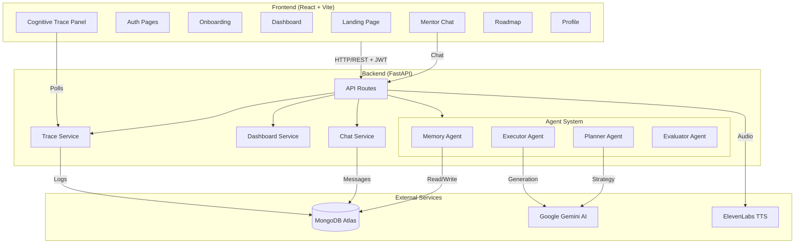
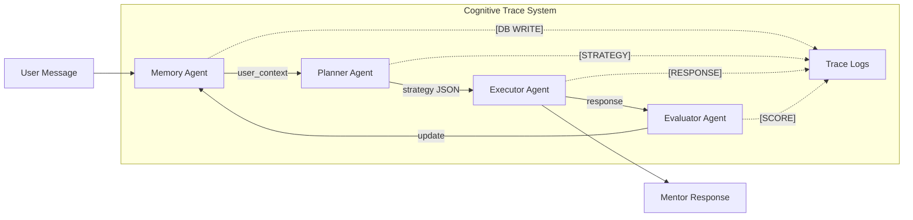
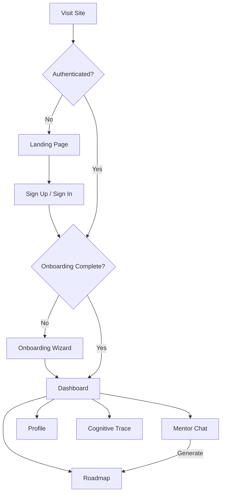
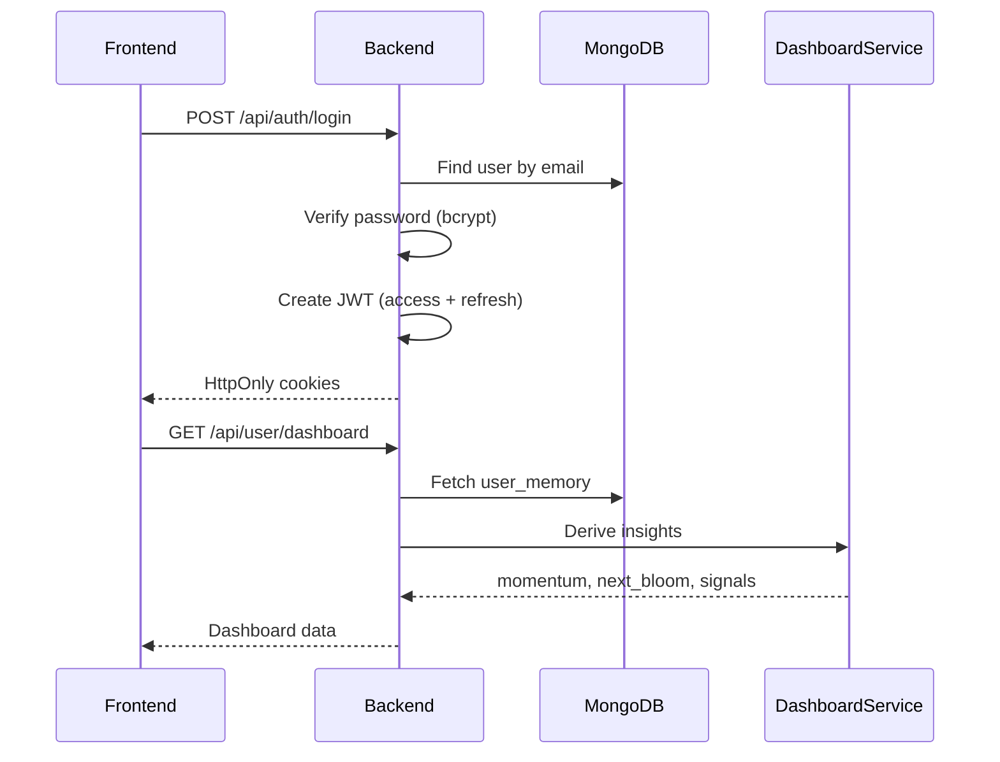
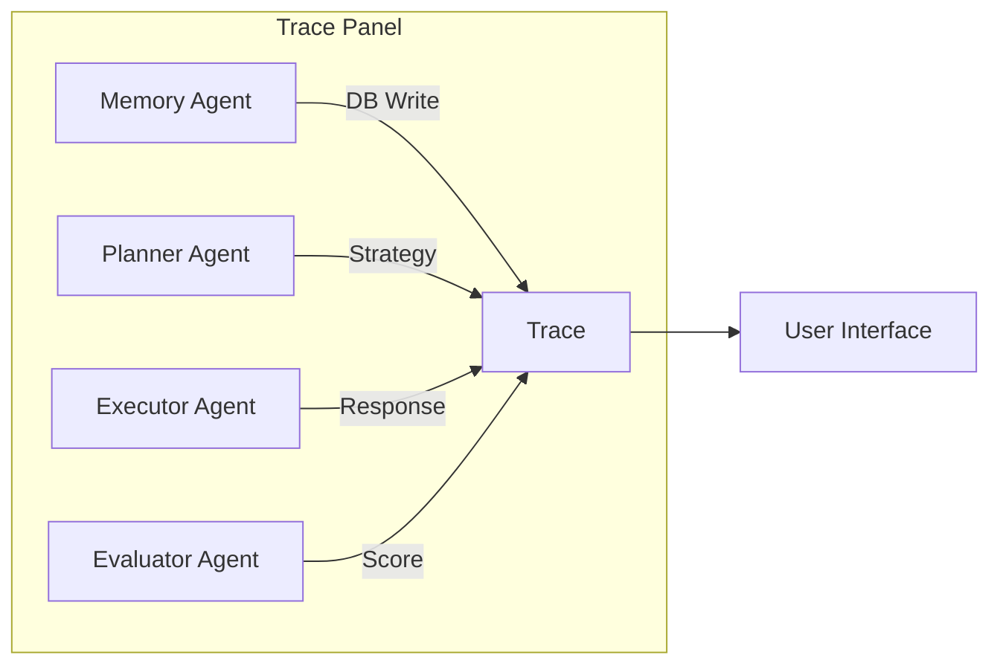
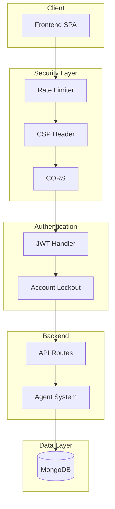

# 🧠 Synapse — Your AI Growth Mentor

> A calm, intelligent AI mentor that guides your personal and professional growth through thoughtful conversations and personalized learning roadmaps.


---

## 📋 Table of Contents

- [Overview](#overview)
- [🛠 Tech Stack](#tech-stack)
- [🏗 Architecture](#architecture)
- [🚀 Getting Started](#getting-started)
- [📁 Project Structure](#project-structure)
- [✨ Features](#features)
- [🔐 Security](#security)
- [📡 API Reference](#api-reference)
- [🎨 Brand Guidelines](#brand-guidelines)
- [📚 Documentation](#documentation)
- [🤝 Contributing](#contributing)
- [📄 License](#license)

---

## 🌟 Overview

Synapse is an **AI-powered growth mentorship platform** that provides:

| Feature | Description |
|---------|-------------|
| **Personalized Guidance** | Understands your goals and adapts to your learning style |
| **Learning Roadmaps** | AI-generated pathways broken into actionable stages and steps |
| **Progress Tracking** | Momentum analysis with clarity scores (not just session counts) |
| **Cognitive Trace System** | Real-time visualization of AI reasoning ("Jury Mode") |
| **Calm Experience** | Designed to be thoughtful, supportive, not overwhelming |

### Why Synapse?

Unlike generic chatbots, Synapse employs a **multi-agent architecture** where four specialized AI agents collaborate to deliver thoughtful, adaptive mentoring:

- **Memory Agent** — Remembers your goals, struggles, and progress
- **Planner Agent** — Decides response strategy based on understanding level
- **Executor Agent** — Generates personalized responses and roadmaps
- **Evaluator Agent** — Analyzes comprehension and enforces honest progress tracking

---

## 🛠 Tech Stack

### Frontend Technologies

| Category | Technology | Version | Purpose |
|----------|------------|---------|---------|
| **Framework** | React | 18.3.x | UI Framework |
| **Language** | TypeScript | 5.8.x | Type Safety |
| **Build Tool** | Vite | 7.3.x | Fast development & builds |
| **Styling** | TailwindCSS | 3.4.x | Utility-first CSS |
| **Components** | shadcn/ui | latest | Accessible component library |
| **Animations** | Framer Motion | 12.x | Smooth UI transitions |
| **Routing** | React Router | 6.x | Client-side routing |
| **State/Query** | TanStack Query | 5.x | Server state management |
| **Forms** | React Hook Form + Zod | 7.x / 3.x | Form validation |
| **Icons** | Lucide React | 0.46x | SVG icon library |
| **Markdown** | React Markdown | 10.x | Render markdown content |
| **Auth** | Supabase Client | 2.x | Auth integration |

### Backend Technologies

| Category | Technology | Version | Purpose |
|----------|------------|---------|---------|
| **Framework** | FastAPI | 0.128.x | Modern Python web framework |
| **Server** | Uvicorn | 0.40.x | ASGI server |
| **Language** | Python | 3.10+ | Backend language |
| **Database** | MongoDB (Motor) | 3.7.x | Async MongoDB driver |
| **AI/LLM** | Google Gemini | 0.8.x | AI response generation |
| **TTS** | ElevenLabs | latest | Text-to-speech |
| **Validation** | Pydantic | 2.12.x | Data validation |
| **Auth** | python-jose | 3.5.x | JWT token handling |
| **Password** | passlib + bcrypt | 1.7.x / 5.x | Secure password hashing |
| **HTTP** | httpx | 0.28.x | Async HTTP client |
| **Settings** | pydantic-settings | 2.x | Environment configuration |

### Database

| Service | Type | Purpose |
|---------|------|---------|
| **MongoDB Atlas** | Document Database | Primary data store for users, memory, chats, roadmaps |

### Development Tools

| Category | Tool | Purpose |
|----------|------|---------|
| **Testing** | Vitest | Frontend testing |
| **Linting** | ESLint + Ruff | Code quality |
| **Formatting** | Prettier + Black | Code formatting |
| **Type Checking** | TypeScript | Static type checking |

---

## 🏗 Architecture

### High-Level System Architecture


```mermaid
flowchart TB
    subgraph Frontend["Frontend (React + Vite)"]
        LP[Landing Page]
        AUTH[Auth Pages]
        OB[Onboarding]
        DASH[Dashboard]
        MENTOR[Mentor Chat]
        TRACE_UI[Cognitive Trace Panel]
        ROAD[Roadmap]
        PROF[Profile]
    end
    
    subgraph Backend["Backend (FastAPI)"]
        API[API Routes]
        subgraph Agents["Agent System"]
            MEM[Memory Agent]
            PLAN[Planner Agent]
            EXEC[Executor Agent]
            EVAL[Evaluator Agent]
        end
        DASH_SVC[Dashboard Service]
        TRACE_SVC[Trace Service]
        CHAT_SVC[Chat Service]
    end
    
    subgraph External["External Services"]
        MONGO[(MongoDB Atlas)]
        GEMINI[Google Gemini AI]
        ELEVEN[ElevenLabs TTS]
    end
    
    Frontend --> |HTTP/REST + JWT| API
    API --> Agents
    API --> DASH_SVC
    API --> CHAT_SVC
    API --> TRACE_SVC
    
    MEM --> |Read/Write| MONGO
    CHAT_SVC --> |Messages| MONGO
    TRACE_SVC --> |Logs| MONGO
    
    PLAN --> |Strategy| GEMINI
    EXEC --> |Generation| GEMINI
    API --> |Audio| ELEVEN
    
    MENTOR --> |Chat| API
    TRACE_UI --> |Polls| TRACE_SVC
```

### Multi-Agent Pipeline


```mermaid
flowchart LR
    MSG[User Message] --> MEM[Memory Agent]
    MEM --> |user_context| PLAN[Planner Agent]
    PLAN --> |strategy JSON| EXEC[Executor Agent]
    EXEC --> |response| EVAL[Evaluator Agent]
    EVAL --> |update| MEM
    
    subgraph Logging["Cognitive Trace System"]
        MEM -.-> |"[DB WRITE]"| LOG[Trace Logs]
        PLAN -.-> |"[STRATEGY]"| LOG
        EXEC -.-> |"[RESPONSE]"| LOG
        EVAL -.-> |"[SCORE]"| LOG
    end
    
    EXEC --> RESP[Mentor Response]
```

### User Flow


```mermaid
flowchart TD
    A[Visit Site] --> B{Authenticated?}
    B -->|No| C[Landing Page]
    C --> D[Sign Up / Sign In]
    D --> E{Onboarding Complete?}
    E -->|No| F[Onboarding Wizard]
    F --> G[Dashboard]
    B -->|Yes| E
    E -->|Yes| G
    G --> H[Mentor Chat]
    G --> I[Roadmap]
    G --> J[Profile]
    G --> K[Cognitive Trace]
    H -->|Generate| I
```

### Data Flow Diagram


```mermaid
sequenceDiagram
    Frontend->>Backend: POST /api/auth/login
    Backend->>MongoDB: Find user by email
    Backend->>Backend: Verify password (bcrypt)
    Backend->>Backend: Create JWT (access + refresh)
    Backend-->>Frontend: HttpOnly cookies
    Frontend->>Backend: GET /api/user/dashboard
    Backend->>MongoDB: Fetch user_memory
    Backend->>DashboardService: Derive insights
    DashboardService-->>Backend: momentum, next_bloom, signals
    Backend-->>Frontend: Dashboard data
```

---

## 🚀 Getting Started

### Prerequisites

| Requirement | Version | Description |
|-------------|---------|-------------|
| **Node.js** | 18+ | Frontend runtime |
| **Python** | 3.10+ | Backend runtime |
| **MongoDB Atlas** | - | Database (free tier works) |
| **Google AI Studio** | - | Gemini API key |
| **ElevenLabs** | - | TTS API key (optional) |

### Environment Setup

#### 1. Clone the Repository

```bash
git clone https://github.com/akshanshmaurya/synapse.git
cd synapse
```

#### 2. Frontend Setup

```bash
# Install dependencies
npm install

# Start development server
npm run dev
```

**Frontend runs at:** `http://localhost:5173`

#### 3. Backend Setup

```bash
# Navigate to backend directory
cd backend

# Create virtual environment (Windows)
python -m venv venv
.\\venv\\Scripts\\activate

# Create virtual environment (macOS/Linux)
python3 -m venv venv
source venv/bin/activate

# Install dependencies
pip install -r requirements.txt

# Create environment file
copy .env.example .env
# Edit .env with your credentials
```

#### 4. Environment Variables

Create `backend/.env` by copying from `.env.example`:

```bash
# Copy the template
copy .env.example .env

# Edit .env with your actual values - see .env.example for all options
```

The `.env.example` file contains:

| Variable | Required | Description |
|----------|----------|-------------|
| `GEMINI_API_KEY` | ✅ | Get from https://aistudio.google.com/app/apikey |
| `MONGO_URI` | ✅ | MongoDB connection string (mongodb+srv://...) |
| `MONGODB_DB` | ✅ | Database name (e.g., synapse) |
| `JWT_SECRET` | ✅ | Generate with `python -c "import secrets; print(secrets.token_urlsafe(64))"` |
| `ELEVENLABS_API_KEY` | ❌ | For TTS voice output |
| `ACCESS_TOKEN_EXPIRE_MINUTES` | ❌ | Default: 30 |
| `ENVIRONMENT` | ❌ | development or production |

#### 5. Start Backend Server

```bash
# From backend directory
python -m uvicorn app.main:app --reload --port 8000
```

**Backend runs at:** `http://localhost:8000`  
**API Docs:** `http://localhost:8000/docs` (Swagger UI)

### Quick Start Checklist

- [ ] Clone repository
- [ ] Install Node.js 18+ and Python 3.10+
- [ ] Create MongoDB Atlas cluster
- [ ] Get Google Gemini API key
- [ ] Run `npm install` in project root
- [ ] Run `pip install -r backend/requirements.txt`
- [ ] Create `.env` file in `backend/` directory
- [ ] Start backend: `python -m uvicorn app.main:app --reload --port 8000`
- [ ] Start frontend: `npm run dev`
- [ ] Open `http://localhost:5173`

---

## 📁 Project Structure

```
synapse/
│
├── 📂 src/                          # React Frontend
│   ├── App.tsx                      # Root component & routing
│   ├── main.tsx                     # Entry point
│   ├── index.css                    # Brand design system
│   │
│   ├── 📂 pages/                    # Route components
│   │   ├── LandingPage.tsx          # Marketing page
│   │   ├── SignInPage.tsx           # Login page
│   │   ├── SignUpPage.tsx           # Registration page
│   │   ├── OnboardingPage.tsx       # User setup wizard
│   │   ├── DashboardPage.tsx        # Progress overview
│   │   ├── MentorPage.tsx           # Chat interface
│   │   ├── RoadmapPage.tsx          # Learning pathways
│   │   ├── ProfilePage.tsx          # User settings
│   │   └── NotFound.tsx             # 404 page
│   │
│   ├── 📂 components/               # Reusable UI
│   │   ├── Logo.tsx                 # Brand wordmark
│   │   ├── ProtectedRoute.tsx       # Auth guard
│   │   ├── AuthForm.tsx             # Shared auth logic
│   │   ├── CognitiveTracePanel.tsx  # AI reasoning display
│   │   ├── Sidebar.tsx              # Navigation sidebar
│   │   └── 📂 ui/                   # shadcn/ui components (49)
│   │
│   ├── 📂 contexts/
│   │   └── AuthContext.tsx          # Global auth state
│   │
│   ├── 📂 services/
│   │   └── api.ts                   # HTTP client (313 lines)
│   │
│   └── 📂 hooks/
│       └── use-mobile.tsx           # Mobile detection
│
├── 📂 backend/                      # FastAPI Backend
│   ├── 📂 app/
│   │   ├── main.py                  # FastAPI app entry
│   │   │
│   │   ├── 📂 agents/               # AI Agent System
│   │   │   ├── memory_agent.py      # User context & persistence
│   │   │   ├── planner_agent.py     # Strategy decisions
│   │   │   ├── executor_agent.py    # Response generation
│   │   │   └── evaluator_agent.py   # Understanding analysis
│   │   │
│   │   ├── 📂 services/
│   │   │   ├── agent_orchestrator.py # Pipeline coordination
│   │   │   ├── dashboard_service.py  # Derived insights
│   │   │   ├── chat_service.py       # Message CRUD
│   │   │   ├── trace_service.py      # Cognitive logging
│   │   │   ├── tts.py               # ElevenLabs TTS
│   │   │   ├── llm_utils.py         # Gemini config
│   │   │   └── prompt_templates.py  # Shared prompts
│   │   │
│   │   ├── 📂 routes/
│   │   │   ├── auth.py              # Authentication endpoints
│   │   │   ├── onboarding.py        # Onboarding endpoints
│   │   │   ├── roadmap.py           # Roadmap CRUD
│   │   │   ├── chat_history.py      # Session management
│   │   │   └── trace.py             # Trace API
│   │   │
│   │   ├── 📂 models/               # Pydantic schemas
│   │   │   ├── user.py              # User models
│   │   │   ├── memory.py            # UserMemory schema
│   │   │   ├── roadmap.py           # Roadmap schema
│   │   │   ├── chat.py              # Chat models
│   │   │   └── session.py           # Session models
│   │   │
│   │   ├── 📂 auth/
│   │   │   ├── dependencies.py      # Auth middleware
│   │   │   ├── jwt_handler.py       # Token creation/validation
│   │   │   └── password.py          # Password hashing
│   │   │
│   │   ├── 📂 db/
│   │   │   └── mongodb.py           # MongoDB connection
│   │   │
│   │   └── 📂 core/
│   │       ├── config.py            # Settings
│   │       ├── middleware.py        # Security headers
│   │       └── rate_limiter.py      # Rate limiting
│   │
│   ├── requirements.txt             # Python dependencies
│   ├── pyproject.toml               # Python config
│   └── Dockerfile                   # Container config
│
├── 📂 docs/                         # Documentation
│   ├── BACKEND_ANALYSIS.md          # Backend detailed analysis
│   ├── FRONTEND_ANALYSIS.md         # Frontend detailed analysis
│   ├── PROJECT_TECHNICAL_GUIDE.md   # Technical deep-dive
│   ├── AGENT_MECHANICS.md           # Agent system details
│   └── synapse_audit_report.md      # Security audit
│
├── 📄 package.json                  # Node dependencies
├── 📄 tsconfig.json                 # TypeScript config
├── 📄 vite.config.ts                # Vite config
├── 📄 tailwind.config.ts            # Tailwind config
├── 📄 eslint.config.js              # ESLint config
├── 📄 BRAND_GUIDELINES.md           # Design system
├── 📄 CHANGELOG.md                  # Version history
├── 📄 SECURITY.md                   # Security policy
└── 📄 README.md                     # This file
```

---

## ✨ Features

### 🧠 Cognitive Trace System ("Jury Mode")

| Feature | Description |
|---------|-------------|
| **Live Visualization** | See the AI "think" in real-time |
| **Defensible Reasoning** | Logs every decision (Strategy, Response, Score) |
| **Data Transparency** | Explicit indicators for Database Reads/Writes |
| **Safety** | Logs usage without exposing PII/content |


```mermaid
flowchart LR
    subgraph Trace["Trace Panel"]
        A[Memory Agent] --> |DB Write| T[Trace]
        B[Planner Agent] --> |Strategy| T
        C[Executor Agent] --> |Response| T
        D[Evaluator Agent] --> |Score| T
    end
    T --> UI[User Interface]
```

### 📊 Dashboard

| Feature | Description |
|---------|-------------|
| **Momentum Tracking** | Sessions, progress %, clarity trends |
| **Next Focus** | AI-derived recommended next step |
| **Recent Signals** | Observed learning patterns |
| **Daily Nurture** | Contextual prompt based on activity |
| **Data-Driven** | All insights from user activity (no false praise) |

### 💬 Mentor Chat

| Feature | Description |
|---------|-------------|
| **Context-Aware** | Remembers your goals and struggles |
| **Personalized** | Adapts to your learning style |
| **Multi-Agent** | 4 specialized AI agents collaborate |
| **Voice Output** | Optional TTS (ElevenLabs) |
| **Adaptive Pacing** | Slows down if you're struggling |

### 🗺 Learning Roadmaps

| Feature | Description |
|---------|-------------|
| **AI-Generated** | Based on your goals and level |
| **Structured** | Stages → Steps hierarchy |
| **Interactive** | Mark complete, provide feedback |
| **Adaptive** | Regenerates based on your progress |
| **Visual** | Pathway-style visualization |

### 👤 User Profile

| Feature | Description |
|---------|-------------|
| **Interests** | Add/remove learning interests |
| **Goals** | Track your goals |
| **Stage Display** | seedling → growing → flourishing |
| **Learning Pace** | slow / moderate / fast |
| **Progress History** | View past activity |

### 🔐 Authentication & Security

| Feature | Description |
|---------|-------------|
| **JWT Tokens** | Access (30 min) + Refresh (7 days) |
| **HttpOnly Cookies** | Secure token storage |
| **Account Lockout** | 5 failed attempts = 15 min lock |
| **Rate Limiting** | IP-based request limits |
| **CSP Headers** | Content Security Policy |
| **Password Security** | bcrypt with SHA256 pre-hash |

---

## 🔐 Security

### Implemented Security Measures

| Layer | Protection |
|-------|------------|
| **Authentication** | JWT with access + refresh tokens, HttpOnly cookies |
| **Password** | bcrypt(SHA256(password)) - avoids 72-byte limit |
| **Authorization** | Role-based access control (RBAC) |
| **Rate Limiting** | IP-based: 5 req/min (login), 30 req/min (chat) |
| **Account Lockout** | 5 failed attempts → 15 min lock |
| **CSP** | Strict Content-Security-Policy header |
| **Headers** | X-Content-Type-Options, X-Frame-Options, HSTS |
| **CORS** | Explicit origin allowlist |
| **Input Validation** | Pydantic models with length constraints |

### Security Architecture


```mermaid
flowchart TB
    subgraph Client["Client"]
        FR[Frontend SPA]
    end
    
    subgraph Security["Security Layer"]
        RL[Rate Limiter]
        CSP[CSP Header]
        CORS[CORS]
    end
    
    subgraph Auth["Authentication"]
        JWT[JWT Handler]
        BL[Account Lockout]
    end
    
    subgraph Backend["Backend"]
        API[API Routes]
        AG[Agent System]
    end
    
    subgraph Data["Data Layer"]
        MONGO[(MongoDB)]
    end
    
    FR --> RL
    RL --> CSP
    CSP --> CORS
    CORS --> JWT
    JWT --> BL
    BL --> API
    API --> AG
    AG --> MONGO
```

See [SECURITY.md](./SECURITY.md) for detailed security documentation.

---

## 📡 API Reference

### Authentication Endpoints

| Endpoint | Method | Description |
|----------|--------|-------------|
| `/api/auth/signup` | POST | Create new account |
| `/api/auth/login` | POST | Authenticate user |
| `/api/auth/logout` | POST | Clear sessions |
| `/api/auth/refresh` | POST | Refresh access token |

### User Endpoints

| Endpoint | Method | Description |
|----------|--------|-------------|
| `/api/user/me` | GET | Current user info |
| `/api/user/memory` | GET | User memory document |
| `/api/user/profile` | PUT | Update interests/goals |
| `/api/user/dashboard` | GET | Dashboard insights |
| `/api/user/traces` | GET | Live system activity (admin) |

### Onboarding Endpoints

| Endpoint | Method | Description |
|----------|--------|-------------|
| `/api/onboarding/status` | GET | Check onboarding completion |
| `/api/onboarding/questions` | GET | Get form structure |
| `/api/onboarding/complete` | POST | Submit onboarding answers |

### Chat Endpoints

| Endpoint | Method | Description |
|----------|--------|-------------|
| `/api/chat` | POST | Authenticated mentor chat |
| `/api/chat/guest` | POST | Unauthenticated trial chat |

### Roadmap Endpoints

| Endpoint | Method | Description |
|----------|--------|-------------|
| `/api/roadmap/current` | GET | Active roadmap |
| `/api/roadmap/history` | GET | Archived roadmaps |
| `/api/roadmap/generate` | POST | Create new roadmap |
| `/api/roadmap/feedback` | POST | Submit step feedback |
| `/api/roadmap/regenerate` | POST | Adapt roadmap |

### TTS Endpoints

| Endpoint | Method | Description |
|----------|--------|-------------|
| `/api/tts` | POST | Text-to-speech via ElevenLabs |

---

## 🎨 Brand Guidelines

### Typography

| Element | Font | Weight |
|---------|------|--------|
| Logo | Playfair Display | 500 |
| Headings (h1-h6) | Playfair Display | 400-500 |
| Body text | Inter | 400 |

### Color Palette

| Name | Hex | HSL | Usage |
|------|-----|-----|-------|
| Deep Olive | `#5C6B4A` | 78°, 22%, 35% | Primary, logo, buttons |
| Warm Paper | `#FDF8F3` | 30°, 50%, 98% | Background |
| Charcoal | `#3D3D3D` | 0°, 0%, 24% | Primary text |
| Terracotta | `#D4A574` | 28°, 54%, 65% | Accent, highlights |
| Muted Stone | `#8B8178` | 24°, 19%, 51% | Muted text |

### Design Principles

| Principle | Description |
|-----------|-------------|
| **DO** | Communicate trust, clarity, calm intelligence |
| **DON'T** | Use flashy aesthetics, aggressive visuals |
| **Key** | Consistency over creativity |

See [BRAND_GUIDELINES.md](./BRAND_GUIDELINES.md) for complete guidelines.

---

## 📚 Documentation

| Document | Description |
|----------|-------------|
| [Backend Analysis](./docs/BACKEND_ANALYSIS.md) | API, agents, database schema |
| [Frontend Analysis](./docs/FRONTEND_ANALYSIS.md) | Pages, components, state |
| [Technical Guide](./docs/PROJECT_TECHNICAL_GUIDE.md) | Deep-dive for interviews |
| [Agent Mechanics](./docs/AGENT_MECHANICS.md) | Agent system details |
| [Brand Guidelines](./BRAND_GUIDELINES.md) | Design system |
| [Security Policy](./SECURITY.md) | Security architecture |
| [Changelog](./CHANGELOG.md) | Version history |

---

## 🤝 Contributing

### Development Workflow

```bash
# 1. Fork the repository

# 2. Clone your fork
git clone https://github.com/your-username/synapse.git

# 3. Create a feature branch
git checkout -b feature/amazing-feature

# 4. Make your changes
# - Run linting: npm run lint (frontend)
# - Run tests: npm test (frontend) or pytest (backend)

# 5. Commit your changes
git commit -m 'Add amazing feature'

# 6. Push to your fork
git push origin feature/amazing-feature

# 7. Open a Pull Request
```

### Code Quality

| Check | Frontend Command | Backend Command |
|-------|------------------|-----------------|
| Lint | `npm run lint` | `ruff check app/` |
| Type Check | `tsc --noEmit` | `ruff check app/` |
| Test | `npm test` | `pytest` |

---

## 📄 License

This project is licensed under the **MIT License** - see the [LICENSE](LICENSE) file for details.

---

<p align="center">
  <strong>Synapse</strong> — Built with intention for intentional learners.
  <br>
  <sub>Made with ❤️ using FastAPI + React</sub>
</p>
