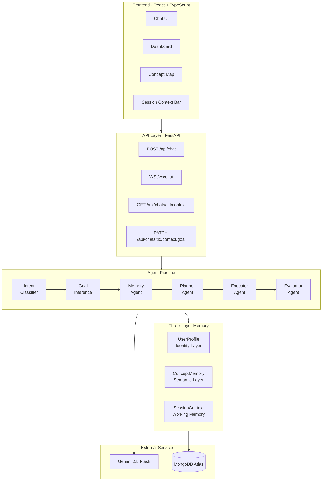
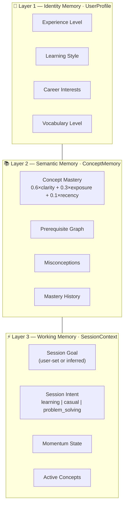
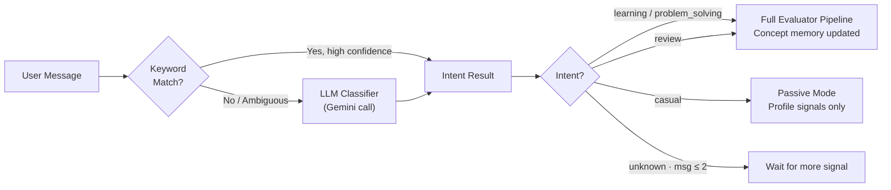

<div align="center">

  

  <h1>Synapse</h1>
  <p><strong>AI Mentorship That Measures Understanding, Not Activity</strong></p>

  <p>
    <a href="https://github.com/akshanshmaurya/Synapse/actions/workflows/ci.yml">
      
    </a>
    
    
  </p>

  <p>
    
    
    
    
    
    
  </p>

  <p>
    
  </p>

  <a href="#getting-started">Quick Start</a> · <a href="#architecture">Architecture</a> · <a href="#research-foundation">Research Foundation</a>

</div>

---

## What is Synapse?

Most AI tutors operate as stateless chatbots. They answer questions, forget everything between sessions, and treat message count as a proxy for progress. A student who asks twenty confused questions gets the same "you're doing great" as one who demonstrates genuine understanding. There is no memory, no model of the learner, and no distinction between activity and comprehension.

Synapse is a multi-agent mentorship system that maintains a persistent cognitive model of each learner across three memory layers — identity, concepts, and session state. Every user message passes through a four-agent pipeline (Memory → Planner → Executor → Evaluator) where intent is classified, session momentum is tracked as a deterministic state machine, and concept mastery is scored using a weighted formula grounded in clarity, exposure, and recency. Casual conversation is detected and isolated so it never corrupts learning metrics. A hardcoded confusion fail-safe overrides all LLM output when struggle markers are present, ensuring the system cannot hallucinate progress.

---

## Architecture

The system is a React frontend communicating with a FastAPI backend through REST and WebSocket endpoints. Every message flows through a six-stage pipeline before and after response generation.


```mermaid
flowchart TD
    subgraph Client["Frontend · React + TypeScript"]
        UI[Chat UI]
        DASH[Dashboard]
        CMAP[Concept Map]
        SESS[Session Context Bar]
    end

    subgraph API["API Layer · FastAPI"]
        CHAT["POST /api/chat"]
        WS["WS /ws/chat"]
        CTX["GET /api/chats/:id/context"]
        GOAL["PATCH /api/chats/:id/context/goal"]
    end

    subgraph Pipeline["Agent Pipeline"]
        direction LR
        IC["Intent\nClassifier"]
        GI["Goal\nInference"]
        MA["Memory\nAgent"]
        PA["Planner\nAgent"]
        EA["Executor\nAgent"]
        EV["Evaluator\nAgent"]
    end

    subgraph Memory["Three-Layer Memory"]
        L1["UserProfile\nIdentity Layer"]
        L2["ConceptMemory\nSemantic Layer"]
        L3["SessionContext\nWorking Memory"]
    end

    subgraph External["External Services"]
        GEM["Gemini 2.5 Flash"]
        MONGO[("MongoDB Atlas")]
    end

    Client --> API
    API --> Pipeline
    IC --> GI --> MA --> PA --> EA --> EV
    Pipeline --> Memory
    Pipeline --> GEM
    Memory --> MONGO
```

### Request Lifecycle

```
User Message
│
▼
[1] Save to DB (sync)
│
▼
[2] Load SessionContext
│
▼
[3] Intent Classification ──── keyword match → O(1)
│                     └─── LLM fallback  → only if ambiguous
▼
[4] Goal Inference ──────────── fires at message 3, learning sessions only
│
▼
[5] Memory Agent ──────────── assembles all 3 memory layers
│
▼
[6] Planner Agent ─────────── deterministic rules first, LLM fallback
│
▼
[7] Executor Agent ────────── response generation via Gemini
│
▼
[8] Save Response (sync) ──── response returned to client here
│
├─── [9] Evaluator (async) ──── intent guard → concept extraction → mastery update
│                          └─── confusion fail-safe (hardcoded invariant)
│
└─── [10] Profile Signals (async, concurrent with 9)
```

Steps 1–8 are synchronous and block the response. Steps 9–10 run in the background after the response is sent, so the user never waits for evaluation.

---

## Memory Architecture

Each memory layer operates at a different timescale and serves a distinct cognitive function, modeled after Tulving's memory taxonomy.


```mermaid
flowchart TD
    subgraph L1["🧠 Layer 1 — Identity Memory · UserProfile"]
        A["Experience Level"]
        B["Learning Style"]
        C["Career Interests"]
        D["Vocabulary Level"]
    end

    subgraph L2["📚 Layer 2 — Semantic Memory · ConceptMemory"]
        E["Concept Mastery\n0.6×clarity + 0.3×exposure + 0.1×recency"]
        F["Prerequisite Graph"]
        G["Misconceptions"]
        H["Mastery History"]
    end

    subgraph L3["⚡ Layer 3 — Working Memory · SessionContext"]
        I["Session Goal\n(user-set or inferred)"]
        J["Session Intent\nlearning | casual | problem_solving"]
        K["Momentum State"]
        L["Active Concepts"]
    end

    L1 --- L2 --- L3
```

| Layer | Collection | Update Frequency | Written By |
|-------|-----------|-----------------|------------|
| UserProfile | `user_profiles` | Rarely (onboarding, major patterns) | ProfileService |
| ConceptMemory | `concept_memory` | Per evaluation (active mode only) | ConceptMemoryService |
| SessionContext | `session_contexts` | Every message | SessionContextService |

> **MongoDB collections (12 total)**
> Core: `users` · `sessions` · `chats` · `messages` · `roadmaps` · `roadmap_feedback` · `agent_logs` · `user_memory` · `interactions`
> Phase 4.7+: `user_profiles` · `concept_memory` · `session_contexts`

**Mastery Formula**

```
mastery_score = (0.6 × avg_clarity) + (0.3 × exposure_rate) + (0.1 × recency_weight)

Where:
  avg_clarity     = mean clarity score across all sessions discussing this concept
  exposure_count  = number of times concept was actively discussed
  recency_weight  = 1.0 if seen in last 7 days, decaying toward 0.1 over 30 days
```

---

## Intent Classification

Not every message carries learning intent. A student saying "lol that's funny" should not update their recursion mastery score. The intent classifier gates the entire evaluation pipeline — casual sessions extract profile signals only and never write to concept memory.


```mermaid
flowchart LR
    MSG[User Message] --> KC{Keyword\nMatch?}
    KC -->|"Yes, high confidence"| INTENT[Intent Result]
    KC -->|"No / Ambiguous"| LLM["LLM Classifier\n(Gemini call)"]
    LLM --> INTENT

    INTENT --> L{Intent?}
    L -->|"learning / problem_solving"| FULL["Full Evaluator Pipeline\nConcept memory updated"]
    L -->|casual| PASS["Passive Mode\nProfile signals only"]
    L -->|review| FULL
    L -->|"unknown · msg ≤ 2"| WAIT["Wait for more signal"]
```

| Intent | Concept Memory | Session Clarity | Momentum | Profile Signals |
|--------|---------------|----------------|----------|----------------|
| `learning` | ✅ Updated | ✅ Updated | ✅ Updated | ✅ Updated |
| `problem_solving` | ✅ Updated | ✅ Updated | ✅ Updated | ✅ Updated |
| `review` | ✅ Updated | ✅ Updated | ✅ Updated | ✅ Updated |
| `casual` | ❌ Skipped | ❌ Skipped | ❌ Skipped | ✅ Updated |
| `unknown` (msg ≤ 2) | ❌ Skipped | ❌ Skipped | ❌ Skipped | ✅ Updated |

---

## Features

<table>
<tr>
<td width="50%">

**🧠 Three-Layer Adaptive Memory**
Persistent cognitive model across identity, concepts, and session — each layer
updated at the appropriate timescale and never mixed.

**🎯 Session Goal Tracking**
Goals set explicitly or inferred at message 3 for learning sessions. Shown as
a suggestion before confirmation. Confirmed goals are never overwritten.

**🛡️ Confusion Fail-Safe**
A hardcoded invariant in `evaluator_agent.py` — 11 confusion markers override
LLM output and lock the clarity score downward. Cannot be bypassed by prompt
engineering.

**📊 Concept Map**
D3-powered visualization of concept mastery with prerequisite edges and ZPD
readiness scoring. Clicking a concept opens a detail panel with misconceptions
and mastery history.

</td>
<td width="50%">

**🔍 Intent Classification**
Every message classified as `learning`, `problem_solving`, `casual`, or `review`
before entering the evaluation pipeline. Casual sessions never write to concept
memory.

**🗺️ Learning Roadmaps**
AI-generated step-by-step roadmaps. Roadmaps regenerate automatically when
struggle feedback crosses a threshold. Previous versions are archived.

**📈 Learning Analytics**
Clarity trend charts, session activity, momentum history, concept velocity,
and ZPD-based next-step recommendations — all computed deterministically,
never stored as derived state.

**🎓 Interview Prep Mode** *(planned — Phase 8)*
Dedicated session type with per-question scoring for DSA, System Design,
and Behavioral interviews.

</td>
</tr>
</table>

---

## Tech Stack

| Layer | Technology | Details |
|-------|-----------|--------|
| **Backend** | FastAPI 0.128 · Python 3.11 | Async with Motor, Pydantic v2 validation |
| **Frontend** | React 18.3 · TypeScript 5.8 · Vite | TailwindCSS · shadcn/ui · Framer Motion |
| **Database** | MongoDB Atlas | 12 collections, async index creation on startup |
| **AI** | Google Gemini 2.5 Flash | All LLM calls — agents, intent classification, goal inference |
| **Auth** | JWT in HttpOnly cookies | bcrypt(SHA256(password)) · account lockout after 5 attempts |
| **Real-time** | WebSocket | 3-word chunk streaming with 50ms delays |
| **Infra** | Docker · GitHub Actions | Multi-stage Dockerfile · CI: ruff → pytest + coverage |

---

## Project Structure

```
Synapse/
├── backend/
│   ├── app/
│   │   ├── agents/
│   │   │   ├── memory_agent.py          # Layer assembly — loads profile, concepts, session
│   │   │   ├── planner_agent.py         # Deterministic rules + LLM fallback strategy
│   │   │   ├── executor_agent.py        # Response generation via Gemini
│   │   │   └── evaluator_agent.py       # Async post-response analysis + confusion fail-safe
│   │   ├── services/
│   │   │   ├── agent_orchestrator.py    # Pipeline coordinator — runs the 4-agent chain
│   │   │   ├── intent_classifier_service.py   # Keyword-first, LLM-fallback intent detection
│   │   │   ├── goal_inference_service.py      # Fires at message 3, learning sessions only
│   │   │   ├── session_context_service.py     # Layer 3 CRUD + momentum state machine
│   │   │   ├── concept_memory_service.py      # Layer 2 CRUD + mastery formula
│   │   │   ├── profile_service.py             # Layer 1 CRUD + strength/weakness updates
│   │   │   ├── learning_pattern_service.py    # Velocity analysis + struggle detection
│   │   │   ├── learning_cycle_service.py      # Periodic meta-analysis orchestrator
│   │   │   └── dashboard_service.py           # Analytics aggregation
│   │   ├── models/
│   │   │   └── memory_v2.py             # Pydantic schemas for all 3 memory layers
│   │   ├── knowledge/
│   │   │   └── prerequisite_graph.py    # ZPD concept graph + readiness scoring
│   │   ├── auth/                        # JWT handler, password hashing, dependencies
│   │   ├── core/                        # Config, middleware, rate limiter
│   │   ├── routes/                      # REST + WebSocket endpoints
│   │   ├── db/
│   │   │   └── mongodb.py              # Motor client, connection retry, index creation
│   │   └── main.py                      # FastAPI app, lifespan, CORS
│   ├── tests/                           # 169 backend tests across 18 test files
│   ├── Dockerfile                       # Multi-stage build with health check
│   └── requirements.txt
├── src/
│   ├── components/
│   │   ├── chat/
│   │   │   ├── SessionGoalBanner.tsx    # Goal display + edit + inference indicator
│   │   │   ├── MomentumIndicator.tsx    # Visual momentum state (cold→flowing→stuck)
│   │   │   └── ActiveConceptsBar.tsx    # Currently discussed concepts with mastery
│   │   ├── dashboard/                   # Analytics cards, momentum hero, velocity chart
│   │   ├── skeletons/                   # Loading states for all major views
│   │   ├── CognitiveTracePanel.tsx      # Debug panel — full agent pipeline trace
│   │   └── ErrorBoundary.tsx            # React error boundary with fallback UI
│   ├── hooks/
│   │   ├── useSessionContext.ts         # Session context polling + state management
│   │   └── use-mentor-socket.ts         # WebSocket connection hook
│   ├── pages/
│   │   ├── MentorPage.tsx               # Main chat interface
│   │   ├── DashboardPage.tsx            # Learning analytics overview
│   │   ├── ConceptMapPage.tsx           # Interactive concept graph
│   │   ├── RoadmapPage.tsx              # AI-generated learning roadmaps
│   │   ├── AnalyticsPage.tsx            # Detailed progress analytics
│   │   ├── ProfilePage.tsx              # User profile + settings
│   │   ├── OnboardingPage.tsx           # Multi-step onboarding flow
│   │   └── LandingPage.tsx              # Public landing page
│   ├── contexts/
│   │   └── AuthContext.tsx              # JWT auth state + token refresh
│   └── services/
│       └── api.ts                       # Centralized API client
├── .github/workflows/ci.yml            # Ruff lint → pytest + coverage
├── package.json
└── vite.config.ts
```

---

## Getting Started

### Prerequisites

- Python 3.11+
- Node.js 18+
- MongoDB Atlas account (or local MongoDB)
- Google Gemini API key

### 1. Clone the repository

```bash
git clone https://github.com/akshansh-maurya/Synapse.git
cd Synapse
```

### 2. Backend setup

```bash
cd backend
python -m venv venv

# Windows
venv\Scripts\activate
# macOS/Linux
source venv/bin/activate

pip install -r requirements.txt
pip install -r requirements-dev.txt
```

Create `backend/.env`:

```env
# Database
MONGO_URI=
MONGODB_DB=

# Authentication
JWT_SECRET=<run: python -c "import secrets; print(secrets.token_urlsafe(64))">
JWT_ALGORITHM=HS256
ACCESS_TOKEN_EXPIRE_MINUTES=30
REFRESH_TOKEN_EXPIRE_DAYS=7

# AI
GEMINI_API_KEY=<your-gemini-api-key>

# Application
ENVIRONMENT=development
COOKIE_DOMAIN=
```

Start the backend:

```bash
uvicorn app.main:app --reload --port 8000
```

### 3. Frontend setup

```bash
# From the project root (not backend/)
cd ..
npm install
```

Create `.env` in the project root:

```env
VITE_API_URL=http://localhost:8000
```

Start the frontend:

```bash
npm run dev
```

### 4. Verify it's working

- Frontend: [http://localhost:8080](http://localhost:8080)
- Backend health: [http://localhost:8000/health](http://localhost:8000/health)
- API docs: [http://localhost:8000/docs](http://localhost:8000/docs)

---

## Testing

See [backend/TESTING.md](backend/TESTING.md) for the full test suite documentation, including per-module coverage and testing philosophy.

```bash
# Backend tests (169 tests, < 4 minutes)
cd backend
pytest -q

# With coverage
pytest --cov=app --cov-report=term-missing

# Specific test suites
pytest tests/test_intent_goal_services.py -v
pytest tests/test_session_context_service.py -v
pytest tests/test_concept_memory_service.py -v
pytest tests/test_agents_pipeline.py -v

# Frontend tests
cd ..
npm run test
```

CI runs automatically on push to `main` or `dev` and on pull requests to `main`. The pipeline: **ruff lint** → **pytest + coverage**.

---

## Research Foundation

Synapse's architecture draws from seven established frameworks in cognitive science and educational psychology — not as branding, but as direct computational analogs implemented in code.

The three-layer memory model is grounded in **Tulving's (1985)** taxonomy of episodic, semantic, and procedural memory. `UserProfile` captures stable identity traits (semantic self-knowledge), `ConceptMemory` tracks per-concept mastery over time (structured schemas), and `SessionContext` holds ephemeral, goal-directed state (working memory). This decomposition is reinforced by **Baddeley's (2000)** model of working memory as a limited-capacity, actively-maintained buffer — reflected in SessionContext's scoped clarity score and active concept list that reset per chat.

Concept sequencing uses **Vygotsky's (1978)** Zone of Proximal Development. The prerequisite graph in `knowledge/prerequisite_graph.py` computes a readiness score for each concept based on whether its prerequisites have been mastered, surfacing only material the learner is prepared to tackle. The planner's strategy selection follows **Bruner's (1976)** scaffolding theory — deterministic rules lower difficulty and increase support when the learner is stuck and raise the challenge level when they are flowing, with scaffolding levels adjusted based on session momentum.

The mastery formula — `0.6×clarity + 0.3×exposure + 0.1×recency` — is a simplified analog of **Corbett & Anderson's (1994)** Bayesian Knowledge Tracing, combining observed performance (clarity scores from the evaluator), practice frequency (exposure count), and temporal decay (recency weighting). The session momentum state machine (`cold_start → warming_up → flowing → stuck → wrapping_up`) operationalizes **Csikszentmihalyi's (1990)** Flow Theory, with transitions computed deterministically from message count and clarity trends — never by LLM judgment. The mastery formula's recency weighting applies the spacing principle described by **Ebbinghaus (1885)** — concepts unseen for longer periods carry lower mastery scores, creating a natural signal for review. Full spaced repetition scheduling (interval-based review queues) is designed and planned for Phase 8.

---

## Contributing

Synapse welcomes contributions — bug fixes, test coverage improvements, documentation, and new features for the multi-agent pipeline. See [CONTRIBUTING.md](CONTRIBUTING.md) for branch naming conventions, code standards, and commit message format.

```bash
# Quick dev setup for contributors
git clone https://github.com/akshansh-maurya/Synapse.git
cd Synapse && npm install
cd backend && pip install -r requirements.txt -r requirements-dev.txt
```

---

## License

[MIT](LICENSE) © 2026 Akshansh Maurya

Built with [Google Gemini API](https://ai.google.dev/), [MongoDB Atlas](https://www.mongodb.com/atlas), and [shadcn/ui](https://ui.shadcn.com/).
