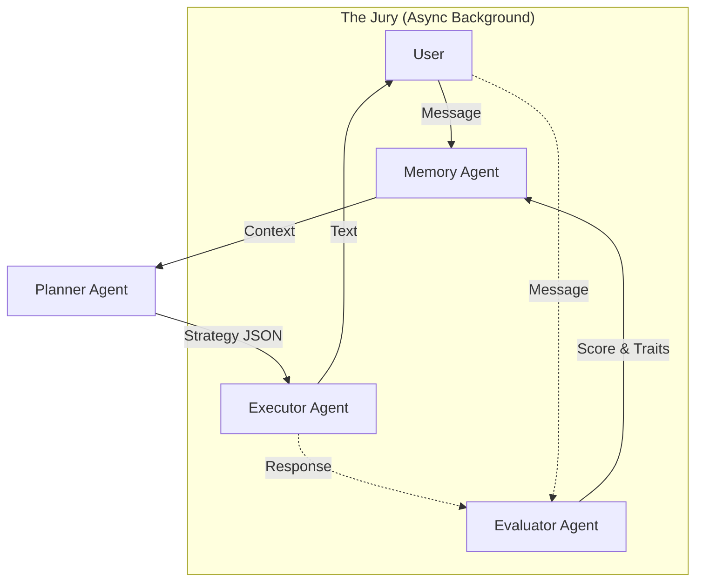

# 🧠 Synapse Agent Mechanics

This document explains **HOW** each agent performs its assignment—the internal logic, prompt engineering, and safeguards that drive the system.

---

## 1. Memory Agent ("The Librarian")
**Assignment:** Provide context and store patterns.
**Mechanism:** MongoDB Aggregation + Summary Generation.

### How it works:
1.  **Context Assembly**:
    *   It pulls raw data from 3 separate MongoDB collections: `users` (profile), `user_memory` (struggles/progress), and `interactions` (chat history).
    *   It stitches this into a single `user_context` Python dictionary.
2.  **Summary Generation**:
    *   It doesn't just pass raw data. It asks Gemini to "create a warm, person-focused summary".
    *   *Input:* Profile + Struggle List.
    *   *Output:* A concise string like "User is a curious beginner struggling with recursion."
3.  **Trait Derivation** (Background Task):
    *   It calculates "Perseverance" using a math formula, not AI opinion:
        ```python
        if total_sessions > 10 and avg_clarity < 40:
            perseverance = "high"
        ```
    *   This ensures traits are **factual**, based on behavior.

---

## 2. Planner Agent ("The Strategist")
**Assignment:** Decide *how* to teach, not *what* to say.
**Mechanism:** Context Analysis -> Structured Strategy JSON.

### How it works:
1.  **Input Analysis**:
    *   Receives the `user_context` + current `user_message`.
    *   Checks the **Evaluator's History**:
        *   If `clarity < 40`, it sets a "Slow Down" flag.
        *   If `confusion_trend == worsening`, it forces a "Supportive" tone.
2.  **Prompt Engineering**:
    *   The prompt explicitly forbids writing the final response.
    *   It asks for specific control flags:
        ```json
        {
            "strategy": "teach",
            "tone": "encouraging",
            "verbosity": "brief",
            "should_ask_question": true
        }
        ```
3.  **Output**: A pure JSON object. This acts as the "instructions" for the Executor.

---

## 3. Executor Agent ("The Voice")
**Assignment:** Generate the user-facing text.
**Mechanism:** Strategy Constraints + Strict Formatting Rules.

### How it works:
1.  **Constraint Application**:
    *   It takes the Planner's JSON and applies hard rules to the prompt.
    *   *Rule:* "If verbosity is 'brief', Max Lines = 4."
    *   *Rule:* "Style = Point-to-point explanations."
2.  **Content Generation**:
    *   It uses Gemini to write the text, but the prompt forces it to "Stop once clarity is achieved."
    *   It filters out "filler" words to keep it professional.
3.  **Fail-Safe**:
    *   It does **not** decide if the user learned anything. It only outputs text.

---

## 4. Evaluator Agent ("The Judge")
**Assignment:** Measure understanding (Truthfully).
**Mechanism:** Semantic Analysis + Code-Level Fail-Safe.

### How it works:
1.  **Judgment**:
    *   It reads the `user_message` and `mentor_response`.
    *   It looks for specific **signals of understanding**:
        *   Paraphrasing ("So it works like this...")
        *   New examples ("Like a car engine?")
        *   Correction ("Oh, I was wrong about x.")
2.  **The "Jury" Logic**:
    *   It outputs a `clarity_score` (0-100) and `reasoning`.
3.  **The Code Fail-Safe (The Iron Rule)**:
    *   Before saving, the Python code scans for keywords: *"I don't get it", "Confused"*.
    *   **IF FOUND**: It overrides the AI.
        ```python
        if "don't get it" in message:
            score = previous_score  # Block increase
            delta = 0               # Block positive delta
            reason += "[FAILSAFE TRIGGERED]"
        ```
    *   This guarantees the AI cannot "hallucinate" progress when the user is confused.

---

## 5. Dashboard Service ("The Reporter")
**Assignment:** Show progress to the user.
**Mechanism:** Read-Only Calculation.

### How it works:
1.  **State Logic**:
    *   It never "writes" to the database. It only reads.
    *   It calculates **Momentum** using specific rules:
        *   `Accelerating` = High Clarity + Improving Trend.
        *   `Building` = Moderate Clarity.
        *   *Session count is ignored for this state.*
2.  **Honesty Check**:
    *   If `Effort` is High (many sessions) but `Clarity` is Low, it reports:
        *   *"High effort... but clarity remains challenging."*
    *   It refuses to show "Good Job!" just for showing up.

---

## Summary of Data Flow


