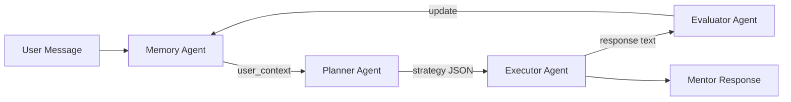
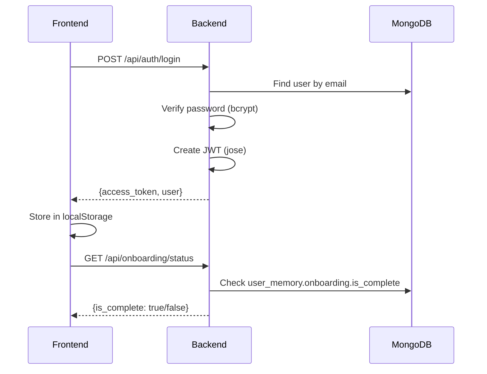

# Synapse Backend Analysis Report

**Generated:** 2026-01-30 (Verified)  
**Framework:** FastAPI + Python 3.x  
**Database:** MongoDB Atlas (via Motor async driver)  
**AI:** Google Gemini 2.5 Flash

---

## 1. Architecture Overview

```
backend/
├── app/
│   ├── main.py              # FastAPI app, routes, lifespan
│   ├── agents/
│   │   ├── memory_agent.py      # Load/update user memory
│   │   ├── planner_agent.py     # Decide response strategy
│   │   ├── executor_agent.py    # Generate responses/roadmaps
│   │   └── evaluator_agent.py   # Analyze & update learning
│   ├── auth/
│   │   ├── jwt_handler.py       # Token creation/validation
│   │   ├── password.py          # Password hashing
│   │   └── dependencies.py      # Auth middleware
│   ├── db/
│   │   └── mongodb.py           # MongoDB connection
│   ├── models/
│   │   ├── user.py              # User Pydantic models
│   │   ├── memory.py            # UserMemory model
│   │   └── roadmap.py           # Roadmap JSON models
│   ├── routes/
│   │   ├── auth.py              # /api/auth/*
│   │   ├── onboarding.py        # /api/onboarding/*
│   │   └── roadmap.py           # /api/roadmap/*
│   └── services/
│       ├── agent_orchestrator.py  # Agent coordinator
│       ├── tts.py                 # ElevenLabs TTS
│       ├── llm_utils.py           # LLM helpers
│       └── prompt_templates.py    # Prompt storage
├── requirements.txt
└── .env
```

---

## 2. Database Collections

| Collection | Purpose | Indexed By |
|:--|:--|:--|
| `users` | User accounts | `email` |
| `sessions` | Login sessions | `user_id` |
| `user_memory` | Profile, onboarding, struggles, progress | `user_id` |
| `interactions` | Chat history | `user_id`, `session_id` |
| `roadmaps` | Learning pathways | `user_id`, `is_active` |
| `roadmap_feedback` | Step feedback history | `roadmap_id` |
| `agent_logs` | Debug logging | `user_id` |

### Key Data Models

#### UserMemory Document
```json
{
  "user_id": "string",
  "onboarding": {
    "is_complete": true,
    "why_here": "string",
    "guidance_type": "string",
    "experience_level": "beginner|intermediate|advanced",
    "mentoring_style": "string",
    "completed_at": "datetime"
  },
  "profile": {
    "interests": ["array"],
    "goals": ["array"],
    "stage": "seedling|growing|flourishing",
    "learning_pace": "slow|moderate|fast"
  },
  "struggles": [{
    "topic": "string",
    "severity": "mild|moderate|significant",
    "count": 1
  }],
  "progress": {
    "total_interactions": 0,
    "roadmap_regeneration_count": 0,
    "current_roadmap_id": "string"
  }
}
```

#### Roadmap Document (Frontend-Ready JSON)
```json
{
  "user_id": "string",
  "title": "string",
  "goal": "string",
  "is_active": true,
  "version": 1,
  "total_steps": 12,
  "completed_steps": 0,
  "stages": [{
    "id": "stage-abc123",
    "name": "Planting Seeds",
    "status": "pending",
    "ui_hints": {"color": "#5C6B4A"},
    "steps": [{
      "id": "step-xyz789",
      "title": "Learn the basics",
      "step_type": "learn|practice|build|reflect|milestone",
      "status": "pending",
      "user_feedback": [],
      "ui_hints": {"estimated_time": "30 mins"}
    }]
  }]
}
```

---

## 3. API Endpoints

### Authentication (`/api/auth`)
| Method | Endpoint | Description |
|:--|:--|:--|
| POST | `/signup` | Create account + initialize memory |
| POST | `/login` | Authenticate, return JWT |

### User (`/api/user`) - In main.py
| Method | Endpoint | Description |
|:--|:--|:--|
| GET | `/me` | Get current user + onboarding status |
| GET | `/memory` | Get user memory document |
| PUT | `/profile` | Update interests/goals |

### Onboarding (`/api/onboarding`)
| Method | Endpoint | Description |
|:--|:--|:--|
| GET | `/status` | Check if onboarding complete |
| GET | `/questions` | Get form structure |
| POST | `/complete` | Submit onboarding answers |

### Chat (`/api/chat`) - In main.py
| Method | Endpoint | Description |
|:--|:--|:--|
| POST | `/` | Authenticated mentor chat |
| POST | `/guest` | Unauthenticated trial chat |

**Chat Behavior:**
- Checks onboarding status first
- If incomplete, returns `requires_onboarding: true`
- Runs full agent pipeline (Memory → Planner → Executor → Evaluator)

### Roadmap (`/api/roadmap`)
| Method | Endpoint | Description |
|:--|:--|:--|
| GET | `/current` | Get active roadmap |
| GET | `/history` | Get archived roadmaps |
| POST | `/generate` | Create new roadmap |
| POST | `/feedback` | Submit step feedback |
| POST | `/regenerate` | Adapt roadmap based on feedback |
| PUT | `/step/{roadmap_id}/{step_id}/complete` | Mark step done |

### TTS (`/api/tts`) - In main.py
| Method | Endpoint | Description |
|:--|:--|:--|
| POST | `/` | Text-to-speech via ElevenLabs |

---

## 4. Agent System



### Agent Responsibilities

| Agent | Input | Output | Writes to DB |
|:--|:--|:--|:--:|
| **Memory** | user_id | user_context dict | ✅ |
| **Planner** | context + message | strategy JSON | ❌ |
| **Executor** | context + strategy | response text / roadmap JSON | ❌ |
| **Evaluator** | interaction data | learning pace updates | ✅ |

### Memory Agent
```python
# Methods:
- get_user_context(user_id)     # Load memory for other agents
- store_interaction(...)         # Save chat history
- update_struggle(...)           # Track difficulty areas
- update_profile(...)            # Update interests/goals/pace
- generate_context_summary(...)  # AI summary for context
```

### Planner Agent
```python
# Returns JSON like:
{
  "strategy": "encourage|teach|explore|clarify",
  "tone": "warm|curious|supportive",
  "focus_areas": ["topic1", "topic2"],
  "should_ask_question": true,
  "roadmap_needed": false
}
```

### Executor Agent
```python
# Generates:
- generate_response(context, message, strategy)  # Mentor response
- generate_roadmap(user_id, goal, context)       # New roadmap JSON
- regenerate_roadmap(user_id, old, feedback)     # Adapted roadmap
```

### Evaluator Agent
```python
# Analyzes and updates:
- evaluate_interaction(...)           # Detect struggles, engagement
- detect_struggle(message)            # Quick struggle check
- analyze_roadmap_feedback(...)       # Learning pace adjustment
- update_memory_from_evaluation(...)  # Write to DB
- update_memory_from_roadmap_feedback(...)
```

---

## 5. Authentication Flow



### JWT Configuration
```python
ALGORITHM = "HS256"
ACCESS_TOKEN_EXPIRE_MINUTES = 60 * 24 * 7  # 7 days
SECRET_KEY = os.getenv("JWT_SECRET_KEY")  # 64-byte secure token
```

---

## 6. Environment Variables

```bash
# .env
GEMINI_API_KEY=xxx
ELEVENLABS_API_KEY=xxx
MONGODB_URL=mongodb+srv://...
MONGODB_DB=database
JWT_SECRET_KEY=<64-byte-secure-token>
```

---

## 7. What Works Right Now

| Feature | Status | Notes |
|:--|:--:|:--|
| User signup | ✅ | Creates user + initializes memory |
| User login | ✅ | Returns JWT + checks onboarding |
| Onboarding flow | ✅ | Blocks chat until complete |
| Chat with mentor | ✅ | Full agent pipeline |
| Roadmap generation | ✅ | Nested JSON for frontend |
| Roadmap feedback | ✅ | Per-step + history |
| Roadmap regeneration | ✅ | Uses evaluator analysis |
| Mark step complete | ✅ | Updates step status |
| Learning pace adaptation | ✅ | Updates based on struggles |
| Profile editing | ✅ | Interests, goals |
| TTS endpoint | ✅ | Wired to ElevenLabs |

---

## 8. Running the Backend

```bash
cd c:\Major Projects\gentle-guide\backend
python -m uvicorn app.main:app --reload --port 8000
```

**URL:** http://localhost:8000  
**Docs:** http://localhost:8000/docs (Swagger UI)

**Requirements:**
- Python 3.10+
- MongoDB Atlas connection
- Gemini API key
- Dependencies: `pip install -r requirements.txt`

---

## 9. Dependencies

```txt
fastapi
uvicorn
pydantic[email]
google-genai
python-dotenv
motor
python-jose[cryptography]
passlib[bcrypt]
httpx
python-multipart
requests
```

---

## 10. Security Measures

| Measure | Implementation |
|:--|:--|
| Password hashing | bcrypt via passlib |
| JWT tokens | HS256 with secure key |
| Auth middleware | `get_current_user` dependency |
| CORS | Configured in main.py |
| Env protection | .gitignore covers .env |

---

## 11. Data Flow Summary

```
User Signup → Create User Doc → Initialize UserMemory (onboarding.is_complete=false)
     ↓
Onboarding → Update UserMemory.onboarding → Set is_complete=true
     ↓
Chat → Memory Agent loads context → Planner decides strategy
     ↓
Executor generates response → Evaluator updates struggles/pace
     ↓
Roadmap → Executor generates JSON → Store in roadmaps collection
     ↓
Feedback → Update step in roadmap → Store in feedback collection
     ↓
Regenerate → Evaluator analyzes → Archive old → Create new version
```
