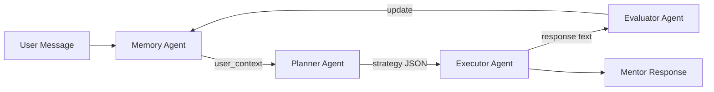
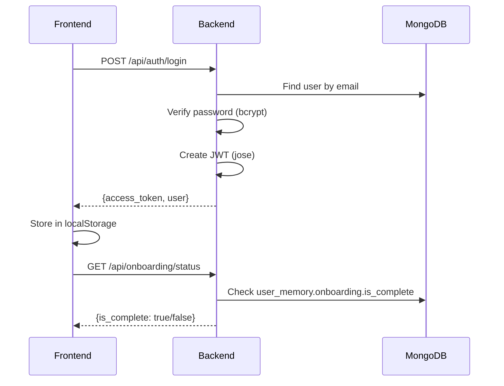

# Synapse Backend Analysis Report

**Last Updated:** 2026-01-30  
**Framework:** FastAPI + Python 3.10+  
**Database:** MongoDB Atlas (via Motor async driver)  
**AI:** Google Gemini 2.5 Flash

---

## 1. Architecture Overview

```
backend/
├── app/
│   ├── main.py                   # FastAPI app, routes, lifespan
│   ├── agents/
│   │   ├── memory_agent.py       # Load/update user memory
│   │   ├── planner_agent.py      # Decide response strategy
│   │   ├── executor_agent.py     # Generate responses/roadmaps
│   │   └── evaluator_agent.py    # Analyze & update learning
│   ├── auth/
│   │   ├── jwt_handler.py        # Token creation/validation
│   │   ├── password.py           # Password hashing
│   │   └── dependencies.py       # Auth middleware
│   ├── db/
│   │   └── mongodb.py            # MongoDB connection
│   ├── models/
│   │   ├── user.py               # User Pydantic models
│   │   ├── memory.py             # UserMemory model
│   │   └── roadmap.py            # Roadmap JSON models
│   ├── routes/
│   │   ├── auth.py               # /api/auth/*
│   │   ├── onboarding.py         # /api/onboarding/*
│   │   └── roadmap.py            # /api/roadmap/*
│   └── services/
│       ├── agent_orchestrator.py # Agent coordinator
│       ├── dashboard_service.py  # Dashboard insights derivation
│       ├── tts.py                # ElevenLabs TTS
│       ├── llm_utils.py          # LLM helpers
│       ├── prompt_templates.py   # Prompt storage
│       └── trace_service.py      # Cognitive Trace logging
├── requirements.txt
└── .env
```

---

## 2. Database Collections

| Collection | Purpose | Indexed By |
|:-----------|:--------|:-----------|
| `users` | User accounts | `email` |
| `sessions` | Login sessions | `user_id` |
| `user_memory` | Profile, onboarding, struggles, progress | `user_id` |
| `interactions` | Chat history | `user_id`, `session_id` |
| `roadmaps` | Learning pathways | `user_id`, `is_active` |
| `roadmap_feedback` | Step feedback history | `roadmap_id` |
| `agent_logs` | Debug logging | `user_id` |
| `system_traces` | Cognitive Trace logs | `request_id`, `timestamp` |

### Key Data Models

#### UserMemory Document

```json
{
  "user_id": "string",
  "onboarding": {
    "is_complete": true,
    "why_here": "string",
    "guidance_type": "string",
    "experience_level": "beginner|intermediate|advanced",
    "mentoring_style": "string",
    "completed_at": "datetime"
  },
  "profile": {
    "interests": ["array"],
    "goals": ["array"],
    "stage": "seedling|growing|flourishing",
    "learning_pace": "slow|moderate|fast",
    "abstraction_level": "concrete|mixed|abstract",
    "autonomy": "guided|semi_guided|self_directed",
    "confidence_trend": "growing|stable|declining"
  },
  "struggles": [{
    "topic": "string",
    "severity": "mild|moderate|significant",
    "count": 1,
    "last_seen": "datetime"
  }],
  "progress": {
    "total_interactions": 0,
    "total_sessions": 0,
    "session_dates": ["datetime"],
    "confusion_count": 0,
    "clarity_reached_count": 0,
    "time_to_clarity_avg": 0,
    "last_session": "datetime",
    "roadmap_regeneration_count": 0,
    "current_roadmap_id": "string"
  }
}
```

#### Roadmap Document

```json
{
  "user_id": "string",
  "title": "string",
  "goal": "string",
  "is_active": true,
  "version": 1,
  "total_steps": 12,
  "completed_steps": 0,
  "stages": [{
    "id": "stage-abc123",
    "name": "Planting Seeds",
    "status": "pending",
    "ui_hints": {"color": "#5C6B4A"},
    "steps": [{
      "id": "step-xyz789",
      "title": "Learn the basics",
      "description": "string",
      "step_type": "learn|practice|build|reflect|milestone",
      "status": "pending|in_progress|completed",
      "user_feedback": [],
      "ui_hints": {"estimated_time": "30 mins"}
    }]
  }]
}
```

#### Cognitive Trace Document

```json
{
  "trace_id": "uuid",
  "request_id": "uuid",
  "agent": "Planner|Executor|Evaluator|Memory|Persistence",
  "action": "Strategy Implemented|Response Generated|...",
  "details": {
    "strategy": "encourage",
    "tone": "warm",
    "clarity_score": 85
  },
  "timestamp": "datetime"
}
```

---

## 3. API Endpoints

### Authentication (`/api/auth`)

| Method | Endpoint | Description |
|:-------|:---------|:------------|
| POST | `/signup` | Create account + initialize memory |
| POST | `/login` | Authenticate, return JWT |

### User (`/api/user`)

| Method | Endpoint | Description |
|:-------|:---------|:------------|
| GET | `/me` | Get current user + onboarding status |
| GET | `/memory` | Get user memory document |
| PUT | `/profile` | Update interests/goals |
| GET | `/dashboard` | **NEW** Get dashboard insights |
| GET | `/traces` | **NEW** Live system activity for Jury Mode |

### Onboarding (`/api/onboarding`)

| Method | Endpoint | Description |
|:-------|:---------|:------------|
| GET | `/status` | Check if onboarding complete |
| GET | `/questions` | Get form structure |
| POST | `/complete` | Submit onboarding answers |

### Chat (`/api/chat`)

| Method | Endpoint | Description |
|:-------|:---------|:------------|
| POST | `/` | Authenticated mentor chat |
| POST | `/guest` | Unauthenticated trial chat |

**Chat Behavior:**
- Checks onboarding status first
- If incomplete, returns `requires_onboarding: true`
- Runs full agent pipeline (Memory → Planner → Executor → Evaluator)

### Roadmap (`/api/roadmap`)

| Method | Endpoint | Description |
|:-------|:---------|:------------|
| GET | `/current` | Get active roadmap |
| GET | `/history` | Get archived roadmaps |
| POST | `/generate` | Create new roadmap |
| POST | `/feedback` | Submit step feedback |
| POST | `/regenerate` | Adapt roadmap based on feedback |
| PUT | `/step/{roadmap_id}/{step_id}/complete` | Mark step done |

### TTS (`/api/tts`)

| Method | Endpoint | Description |
|:-------|:---------|:------------|
| POST | `/` | Text-to-speech via ElevenLabs |

---

## 4. Agent System



### Agent Responsibilities

| Agent | Input | Output | Writes to DB |
|:------|:------|:-------|:------------:|
| **Memory** | user_id | user_context dict | ✅ |
| **Planner** | context + message | strategy JSON | ❌ |
| **Executor** | context + strategy | response text / roadmap JSON | ❌ |
| **Evaluator** | interaction data | learning pace updates | ✅ |

### Memory Agent

```python
# Methods:
- get_user_context(user_id)      # Load memory for other agents
- store_interaction(...)          # Save chat history
- update_struggle(...)            # Track difficulty areas
- update_profile(...)             # Update interests/goals/pace
- generate_context_summary(...)   # AI summary for context
```

### Planner Agent

```python
# Returns JSON like:
{
  "strategy": "encourage|teach|explore|clarify",
  "tone": "warm|curious|supportive",
  "focus_areas": ["topic1", "topic2"],
  "should_ask_question": true,
  "roadmap_needed": false
}
```

### Executor Agent

```python
# Generates:
- generate_response(context, message, strategy)  # Mentor response
- generate_roadmap(user_id, goal, context)       # New roadmap JSON
- regenerate_roadmap(user_id, old, feedback)     # Adapted roadmap
```

### Evaluator Agent

```python
# Analyzes and updates:
- evaluate_interaction(...)            # Detect struggles, engagement
- detect_struggle(message)             # Quick struggle check
- analyze_roadmap_feedback(...)        # Learning pace adjustment
- update_memory_from_evaluation(...)   # Write to DB
- update_memory_from_roadmap_feedback(...)
```

---

## 5. Dashboard Service (NEW)

The Dashboard Service derives display content from raw memory signals without writing to the database. This ensures separation of concerns between data storage (Memory Agent) and display logic.

### Location

`app/services/dashboard_service.py`

### Key Features

| Feature | Description |
|:--------|:------------|
| **Message Variety** | Multiple template variations per state (randomized) |
| **Returning Users** | Special messaging for users returning after 7+ days |
| **Personalized Insights** | Adjusts based on learning pace preference |
| **Contextual Nurture** | Prompts tied to struggles, goals, or activity |

### Methods

```python
class DashboardService:
    async def get_dashboard_insights(user_id: str) -> dict:
        """Main entry point - returns all dashboard data"""
    
    def _derive_momentum(progress, roadmap, profile) -> dict:
        """Calculate momentum state from sessions + clarity"""
    
    def _derive_next_bloom(roadmap, profile) -> dict | None:
        """Find next step from roadmap or infer from goals"""
    
    def _derive_recent_signals(struggles, interactions, progress, profile) -> list:
        """Extract observable patterns, not praise"""
    
    def _derive_daily_nurture(progress, interactions, struggles, profile) -> dict:
        """Contextual prompt if activity today"""
```

### Response Structure

```json
{
  "momentum": {
    "state": "starting|building|steady|accelerating",
    "insight": "You're on a roll — 5 sessions this week...",
    "metrics": {
      "sessions_this_week": 5,
      "roadmap_progress": 35,
      "clarity_trend": "high"
    }
  },
  "next_bloom": {
    "title": "Learn REST API basics",
    "description": "Next step in: Backend Fundamentals",
    "action_hint": "Focus on understanding",
    "source": "roadmap"
  },
  "recent_signals": [
    {
      "observation": "Recurring difficulty with async/await (3 occurrences)",
      "timestamp": "2026-01-30T10:00:00Z",
      "type": "struggle",
      "severity": "moderate"
    }
  ],
  "show_daily_nurture": true,
  "daily_nurture_prompt": "What stood out to you from today's session?"
}
```

---

## 6. Authentication Flow



### JWT Configuration

```python
ALGORITHM = "HS256"
ACCESS_TOKEN_EXPIRE_MINUTES = 60 * 24 * 7  # 7 days
SECRET_KEY = os.getenv("JWT_SECRET_KEY")    # 64-byte secure token
```

---

## 7. Environment Variables

```bash
# .env
GEMINI_API_KEY=xxx
ELEVENLABS_API_KEY=xxx
MONGODB_URL=mongodb+srv://...
MONGODB_DB=synapse
JWT_SECRET_KEY=<64-byte-secure-token>
```

---

## 8. Running the Backend

```bash
cd backend

# Create and activate virtual environment
python -m venv venv
.\venv\Scripts\activate  # Windows
source venv/bin/activate  # macOS/Linux

# Install dependencies
pip install -r requirements.txt

# Run server
python -m uvicorn app.main:app --reload --port 8000
```

**URL:** http://localhost:8000  
**API Docs:** http://localhost:8000/docs (Swagger UI)

---

## 9. Dependencies

```txt
fastapi
uvicorn
pydantic[email]
google-generativeai
python-dotenv
motor
python-jose[cryptography]
passlib[bcrypt]
bcrypt
httpx
python-multipart
requests
```

---

## 10. Security Measures

| Measure | Implementation |
|:--------|:---------------|
| Password hashing | bcrypt via passlib |
| JWT tokens | HS256 with secure key |
| Auth middleware | `get_current_user` dependency |
| CORS | Configured in main.py |
| Env protection | .gitignore covers .env |

---

## 11. Data Flow Summary

```
User Signup → Create User Doc → Initialize UserMemory (onboarding.is_complete=false)
     ↓
Onboarding → Update UserMemory.onboarding → Set is_complete=true
     ↓
Chat → Memory Agent loads context → Planner decides strategy
     ↓
Executor generates response → Evaluator updates struggles/pace
     ↓
Dashboard → DashboardService derives insights from raw signals
     ↓
Roadmap → Executor generates JSON → Store in roadmaps collection
     ↓
Feedback → Update step in roadmap → Store in feedback collection
     ↓
Regenerate → Evaluator analyzes → Archive old → Create new version
```

---

## 12. API Response Examples

### GET /api/user/dashboard

```bash
curl -H "Authorization: Bearer <token>" \
  http://localhost:8000/api/user/dashboard
```

Response:
```json
{
  "momentum": {
    "state": "building",
    "insight": "Building rhythm with 2 sessions this week.",
    "metrics": {
      "sessions_this_week": 2,
      "roadmap_progress": 15,
      "clarity_trend": "moderate"
    }
  },
  "next_bloom": {
    "title": "Understand variables",
    "description": "Foundation concepts for Python",
    "source": "roadmap"
  },
  "recent_signals": [],
  "show_daily_nurture": false,
  "daily_nurture_prompt": null
}
```

### POST /api/chat

```bash
curl -X POST -H "Authorization: Bearer <token>" \
  -H "Content-Type: application/json" \
  -d '{"message": "I am struggling with recursion"}' \
  http://localhost:8000/api/chat
```

Response:
```json
{
  "response": "Recursion can feel tricky at first...",
  "requires_onboarding": false
}
```
