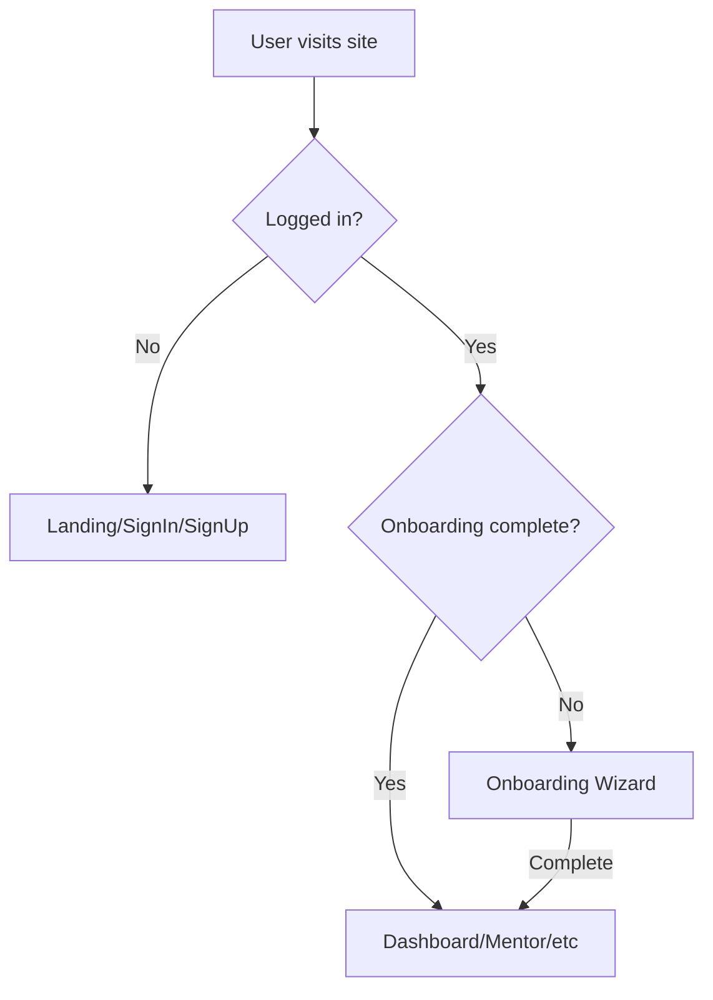

# Synapse Frontend Analysis Report

**Generated:** 2026-01-30 (Updated)  
**Framework:** React + TypeScript + Vite  
**Styling:** TailwindCSS (via shadcn/ui components)

---

## 1. Architecture Overview

```
src/
├── App.tsx              # Root component, routing with ProtectedRoute
├── components/
│   └── ProtectedRoute.tsx  # Auth guard component
├── contexts/
│   └── AuthContext.tsx  # Authentication state management
├── services/
│   └── api.ts           # API service layer
├── pages/
│   ├── LandingPage.tsx
│   ├── SignInPage.tsx
│   ├── SignUpPage.tsx
│   ├── OnboardingPage.tsx
│   ├── DashboardPage.tsx
│   ├── MentorPage.tsx
│   ├── ProfilePage.tsx
│   ├── RoadmapPage.tsx
│   └── NotFound.tsx
└── components/ui/       # shadcn/ui components
```

---

## 2. Pages & Current Capabilities

### 2.1 Landing Page (`/`)
| Feature | Status |
|:--|:--:|
| Hero section with CTA | ✅ |
| Sign In/Sign Up buttons in header | ✅ |
| Auth-aware CTA buttons | ✅ |
| Calm, organic design theme | ✅ |

**Behavior:**
- Shows "Synapse" branding with Sign In/Sign Up in header
- "Begin your journey" → `/signup` (for guests)
- "Continue your journey" → `/dashboard` or `/onboarding` (for authenticated)

---

### 2.2 Sign Up Page (`/signup`)
| Feature | Status |
|:--|:--:|
| Name, email, password form | ✅ |
| Password visibility toggle | ✅ |
| Error handling | ✅ |
| Redirects to onboarding | ✅ |

**API Connected:** `POST /api/auth/signup`  
**Behavior:** After successful signup → redirects to `/onboarding`

---

### 2.3 Sign In Page (`/signin` or `/login`)
| Feature | Status |
|:--|:--:|
| Email, password form | ✅ |
| Error handling | ✅ |
| Checks onboarding status | ✅ |
| Conditional redirect | ✅ |

**API Connected:** `POST /api/auth/login`, `GET /api/onboarding/status`  
**Behavior:**
- If onboarding incomplete → redirects to `/onboarding`
- If onboarding complete → redirects to `/dashboard`

---

### 2.4 Onboarding Page (`/onboarding`)
| Feature | Status |
|:--|:--:|
| 4-step wizard UI | ✅ |
| Progress indicators | ✅ |
| Dynamic question types | ✅ |
| Submit to backend | ✅ |

**Questions Asked:**
1. Why are you here? (textarea)
2. What type of guidance? (select)
3. Experience level? (select)
4. Preferred mentoring style? (select)

**API Connected:**
- `GET /api/onboarding/status` - Check if already complete
- `POST /api/onboarding/complete` - Submit answers

**Behavior:** Blocks access until complete → redirects to `/dashboard`

---

### 2.5 Dashboard Page (`/dashboard`)
| Feature | Status |
|:--|:--:|
| "My Garden" metaphor | ✅ |
| Progress overview cards | ✅ |
| Navigation sidebar | ✅ |
| User greeting | ✅ |
| Fetches user memory | ✅ |

**API Connected:** `GET /api/user/memory`  
**Behavior:** Protected route. Shows growth metrics and quick actions.

---

### 2.6 Mentor Page (`/mentor`)
| Feature | Status |
|:--|:--:|
| Journal-style chat interface | ✅ |
| Message input | ✅ |
| Mentor responses | ✅ |
| Auth-protected via ProtectedRoute | ✅ |
| TTS audio playback | ✅ |

**API Connected:** `POST /api/chat`, `POST /api/tts`  
**Behavior:**
- Blocked until onboarding complete
- Displays mentor responses in calm, reflective style

---

### 2.7 Profile Page (`/profile`)
| Feature | Status |
|:--|:--:|
| "Roots & Identity" theme | ✅ |
| Display user info from memory | ✅ |
| Edit interests (add/remove) | ✅ |
| Edit goals (add/remove) | ✅ |
| Save to backend | ✅ |
| Display learning pace & stage | ✅ |
| Logout button | ✅ |

**API Connected:** `GET /api/user/memory`, `PUT /api/user/profile`  
**Behavior:** Allows user to update their interests and goals

---

### 2.8 Roadmap Page (`/roadmap`)
| Feature | Status |
|:--|:--:|
| "Pathways" visualization | ✅ |
| Stage → Step hierarchy | ✅ |
| Generate new roadmap | ✅ |
| Mark steps as done | ✅ |
| Mark steps as stuck/unclear | ✅ |
| Regenerate roadmap | ✅ |

**API Connected:**
- `GET /api/roadmap/current` - Get active roadmap
- `POST /api/roadmap/generate` - Create new roadmap
- `POST /api/roadmap/feedback` - Submit step feedback
- `POST /api/roadmap/regenerate` - Adapt roadmap

**Behavior:** Renders nested JSON directly. Attaches events to step IDs.

---

## 3. Authentication Flow



### Route Protection
All protected routes are wrapped with `<ProtectedRoute>`:
- Redirects to `/signin` if not authenticated
- Redirects to `/onboarding` if onboarding incomplete

### AuthContext State
```typescript
interface AuthContextType {
  user: User | null;
  token: string | null;
  isAuthenticated: boolean;
  isLoading: boolean;
  onboardingComplete: boolean;
  login: (email, password) => Promise<{needsOnboarding: boolean}>;
  signup: (email, password, name?) => Promise<void>;
  logout: () => void;
  checkOnboarding: () => Promise<boolean>;
}
```

### Token Storage
- JWT stored in `localStorage('auth_token')`
- User object stored in `localStorage('auth_user')`
- Persists across browser sessions

---

## 4. API Service Layer

All API calls go through `src/services/api.ts`:

| Function | Endpoint | Method |
|:--|:--|:--|
| `sendMessage` | `/api/chat` | POST |
| `streamAudio` | `/api/tts` | POST |
| `fetchUserState` | `/api/user/me` | GET |
| `fetchUserMemory` | `/api/user/memory` | GET |
| `updateUserProfile` | `/api/user/profile` | PUT |
| `fetchRoadmap` | `/api/roadmap/current` | GET |
| `generateRoadmap` | `/api/roadmap/generate` | POST |
| `submitRoadmapFeedback` | `/api/roadmap/feedback` | POST |
| `regenerateRoadmap` | `/api/roadmap/regenerate` | POST |

---

## 5. Design System

| Element | Implementation |
|:--|:--|
| Primary Color | `#5C6B4A` (sage green) |
| Background | `#FDF8F3` (warm cream) |
| Accent | `#D4A574` (warm tan) |
| Text | `#3D3D3D` (soft black) |
| Muted | `#8B8178` (warm gray) |
| Font | Serif headings, sans body |
| Animations | Framer Motion |
| Components | shadcn/ui |

---

## 6. What's Connected vs Placeholder

| Feature | Connected to Backend | Notes |
|:--|:--:|:--|
| Sign Up | ✅ | Creates user + memory |
| Sign In | ✅ | Returns JWT + checks onboarding |
| Onboarding | ✅ | Stores in user_memory |
| Chat | ✅ | Full agent pipeline |
| Roadmap CRUD | ✅ | Generate, feedback, regenerate |
| Profile Edit | ✅ | Updates user_memory |
| Dashboard Stats | ✅ | Fetches user memory |
| TTS | ✅ | Wired to ElevenLabs |

---

## 7. Running the Frontend

```bash
cd c:\Major Projects\gentle-guide
npm run dev
```

**URL:** http://localhost:8080

**Requirements:**
- Backend running on port 8000
- Node.js installed
