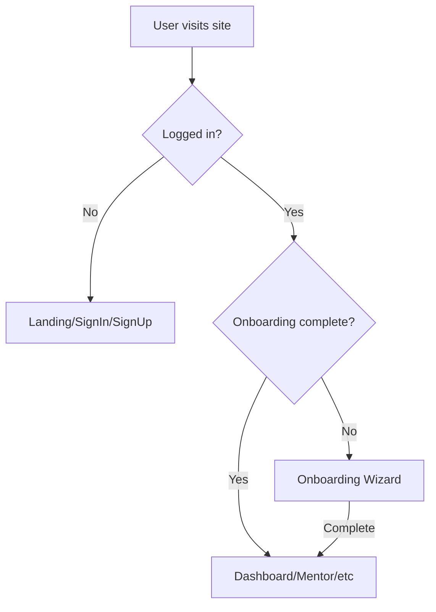

# Synapse Frontend Analysis Report

**Last Updated:** 2026-01-30  
**Framework:** React 18 + TypeScript + Vite  
**Styling:** TailwindCSS + shadcn/ui

---

## 1. Architecture Overview

```
src/
├── App.tsx                  # Root component, routing with ProtectedRoute
├── main.tsx                 # Entry point
├── index.css                # Brand design system & typography
├── components/
│   ├── Logo.tsx             # Brand wordmark component
│   ├── ProtectedRoute.tsx   # Auth guard component
│   ├── CognitiveTracePanel.tsx # Live system activity
│   └── ui/                  # shadcn/ui components
├── contexts/
│   └── AuthContext.tsx      # Authentication state management
├── services/
│   └── api.ts               # API service layer
├── pages/
│   ├── LandingPage.tsx
│   ├── SignInPage.tsx
│   ├── SignUpPage.tsx
│   ├── OnboardingPage.tsx
│   ├── DashboardPage.tsx
│   ├── MentorPage.tsx
│   ├── ProfilePage.tsx
│   ├── RoadmapPage.tsx
│   └── NotFound.tsx
└── hooks/                   # Custom React hooks
```

---

## 2. Pages & Current Capabilities

### 2.1 Landing Page (`/`)

| Feature | Status | Notes |
|:--------|:------:|:------|
| Hero section with CTA | ✅ | Animated with Framer Motion |
| Sign In/Sign Up buttons | ✅ | In sticky header |
| Auth-aware CTA buttons | ✅ | Changes based on login state |
| Calm, organic design | ✅ | Animated background blobs |
| Logo wordmark | ✅ | Uses `<Logo />` component |

**Behavior:**
- Shows "Synapse" wordmark logo in header and footer
- "Begin your journey" → `/signup` (for guests)
- "Continue your journey" → `/dashboard` or `/onboarding` (for authenticated)

---

### 2.2 Sign Up Page (`/signup`)

| Feature | Status |
|:--------|:------:|
| Name, email, password form | ✅ |
| Password visibility toggle | ✅ |
| Error handling | ✅ |
| Redirects to onboarding | ✅ |
| Logo component | ✅ |

**API Connected:** `POST /api/auth/signup`  
**Behavior:** After successful signup → redirects to `/onboarding`

---

### 2.3 Sign In Page (`/signin`)

| Feature | Status |
|:--------|:------:|
| Email, password form | ✅ |
| Error handling | ✅ |
| Checks onboarding status | ✅ |
| Conditional redirect | ✅ |
| Logo component | ✅ |

**API Connected:** `POST /api/auth/login`, `GET /api/onboarding/status`  
**Behavior:**
- If onboarding incomplete → redirects to `/onboarding`
- If onboarding complete → redirects to `/dashboard`

---

### 2.4 Onboarding Page (`/onboarding`)

| Feature | Status |
|:--------|:------:|
| 4-step wizard UI | ✅ |
| Progress indicators | ✅ |
| Dynamic question types | ✅ |
| Submit to backend | ✅ |
| Logo component | ✅ |

**Questions Asked:**
1. Why are you here? (textarea)
2. What type of guidance? (select)
3. Experience level? (select)
4. Preferred mentoring style? (select)

**API Connected:**
- `GET /api/onboarding/status` - Check if already complete
- `POST /api/onboarding/complete` - Submit answers

---

### 2.5 Dashboard Page (`/dashboard`)

| Feature | Status | Notes |
|:--------|:------:|:------|
| Current Momentum | ✅ | Data-driven from sessions & clarity |
| Next Focus | ✅ | From roadmap or inferred goals |
| Recent Signals | ✅ | Observed patterns, not praise |
| Daily Nurture | ✅ | Contextual, only shown when active |
| Navigation sidebar | ✅ | Links to all pages |
| Sign out button | ✅ | In sidebar |
| Logo component | ✅ | In sidebar |

**API Connected:** `GET /api/user/dashboard`

**Dashboard Data Structure:**
```typescript
interface DashboardData {
  momentum: {
    state: "starting" | "building" | "steady" | "accelerating";
    insight: string;
    metrics: {
      sessions_this_week: number;
      roadmap_progress: number;
      clarity_trend: "low" | "moderate" | "high";
    };
  };
  next_bloom: {
    title: string;
    description: string;
    source: "roadmap" | "inferred";
    action_hint?: string;
  } | null;
  recent_signals: {
    observation: string;
    timestamp: string;
    type: "pattern" | "progress" | "struggle";
    severity?: string;
  }[];
  show_daily_nurture: boolean;
  daily_nurture_prompt: string | null;
}
```

**Momentum States:**
- `starting` → "Just Beginning"
- `building` → "Building Rhythm"
- `steady` → "Steady Growth"
- `accelerating` → "Accelerating"

---

### 2.6 Mentor Page (`/mentor`)

| Feature | Status |
|:--------|:------:|
| Journal-style chat interface | ✅ |
| Message input | ✅ |
| Mentor responses | ✅ |
| Auth-protected | ✅ |
| TTS audio playback | ✅ |
| System Activity Panel | ✅ | Live trace visualization |
| Logo component | ✅ |

**API Connected:** `POST /api/chat`, `POST /api/tts`  
**Behavior:** Blocked until onboarding complete

---

### 2.7 Profile Page (`/profile`)

| Feature | Status |
|:--------|:------:|
| Display user info from memory | ✅ |
| Edit interests (add/remove) | ✅ |
| Edit goals (add/remove) | ✅ |
| Save to backend | ✅ |
| Display learning pace & stage | ✅ |
| Sign out button | ✅ |
| Logo component | ✅ |

**API Connected:** `GET /api/user/memory`, `PUT /api/user/profile`

---

### 2.8 Roadmap Page (`/roadmap`)

| Feature | Status |
|:--------|:------:|
| "Pathways" visualization | ✅ |
| Stage → Step hierarchy | ✅ |
| Generate new roadmap | ✅ |
| Mark steps as done | ✅ |
| Mark steps as stuck/unclear | ✅ |
| Regenerate roadmap | ✅ |
| Logo component | ✅ |

**API Connected:**
- `GET /api/roadmap/current`
- `POST /api/roadmap/generate`
- `POST /api/roadmap/feedback`
- `POST /api/roadmap/regenerate`

---

## 3. Authentication Flow



### Route Protection

All protected routes are wrapped with `<ProtectedRoute>`:
- Redirects to `/signin` if not authenticated
- Redirects to `/onboarding` if onboarding incomplete

### AuthContext State

```typescript
interface AuthContextType {
  user: User | null;
  token: string | null;
  isAuthenticated: boolean;
  isLoading: boolean;
  onboardingComplete: boolean;
  login: (email, password) => Promise<{needsOnboarding: boolean}>;
  signup: (email, password, name?) => Promise<void>;
  logout: () => void;
  checkOnboarding: () => Promise<boolean>;
}
```

### Token Storage
- JWT stored in `localStorage('auth_token')`
- User object stored in `localStorage('auth_user')`
- Persists across browser sessions

---

## 4. API Service Layer

All API calls go through `src/services/api.ts`:

| Function | Endpoint | Method |
|:---------|:---------|:-------|
| `sendMessage` | `/api/chat` | POST |
| `streamAudio` | `/api/tts` | POST |
| `fetchUserState` | `/api/user/me` | GET |
| `fetchUserMemory` | `/api/user/memory` | GET |
| `updateUserProfile` | `/api/user/profile` | PUT |
| `fetchDashboardData` | `/api/user/dashboard` | GET |
| `fetchRoadmap` | `/api/roadmap/current` | GET |
| `generateRoadmap` | `/api/roadmap/generate` | POST |
| `submitRoadmapFeedback` | `/api/roadmap/feedback` | POST |
| `regenerateRoadmap` | `/api/roadmap/regenerate` | POST |
| `fetchTraces` | `/api/traces` | GET |

---

## 5. Design System

### Typography

| Element | Font | Weight |
|:--------|:-----|:-------|
| Logo | Playfair Display | 500 |
| Headings (h1-h6) | Playfair Display | 400-500 |
| Body text | Inter | 400 |

### Color Palette

| Name | Hex | Usage |
|:-----|:----|:------|
| Deep Olive | `#5C6B4A` | Primary, logo, buttons |
| Warm Paper | `#FDF8F3` | Background |
| Charcoal | `#3D3D3D` | Primary text |
| Terracotta | `#D4A574` | Accent, highlights |
| Muted Stone | `#8B8178` | Muted text, captions |
| Border | `#E8DED4` | Borders, dividers |

### Animation

- **Library:** Framer Motion
- **Style:** Subtle, calm transitions
- **Duration:** 0.3-0.8s ease-out

---

## 6. Logo Component

The `<Logo />` component is used consistently across all pages:

```tsx
import Logo from "@/components/Logo";

// Default (links to home)
<Logo size="md" />

// Sizes: sm, md, lg, xl
<Logo size="lg" />

// Light variant for dark backgrounds
<Logo variant="light" />

// Without link
<Logo linkToHome={false} />
```

**Styling:**
- Font: Playfair Display (weight 500)
- Color: Deep Olive `#5C6B4A`
- Light variant: Warm Paper `#FDF8F3`

---

## 7. Feature Status Summary

| Feature | Connected to Backend | Notes |
|:--------|:--------------------:|:------|
| Sign Up | ✅ | Creates user + memory |
| Sign In | ✅ | Returns JWT + checks onboarding |
| Onboarding | ✅ | Stores in user_memory |
| Chat | ✅ | Full agent pipeline |
| Dashboard | ✅ | Real-time insights from DashboardService |
| Roadmap CRUD | ✅ | Generate, feedback, regenerate |
| Profile Edit | ✅ | Updates user_memory |
| TTS | ✅ | Wired to ElevenLabs |

---

## 8. Running the Frontend

```bash
# Development
cd gentle-guide
npm install
npm run dev

# Build for production
npm run build

# Preview production build
npm run preview
```

**Development URL:** `http://localhost:5173`

**Requirements:**
- Node.js 18+
- Backend running on port 8000
